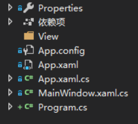

# Roslyn 如何在 Target 引用 xaml 防止文件没有编译

在使用新的项目格式，可以使用 Target 添加项目，但是有一些项目需要在合适的时候添加，如果添加早了，那么会让用户看到这些文件，如果添加的时间是在引用编译之后，那么文件将无法进行编译。

<!--more-->
<!-- csdn -->
<!-- 标签：Roslyn，MSBuild,编译器,xaml,打包 -->

本文是更多请看[手把手教你写 Roslyn 修改编译](https://lindexi.oschina.io/lindexi/post/roslyn.html ) 的一个文章，在开始本文之前，假设大家已经了解 Roslyn 相关。

本文主要是我自己探索 VisualStudio 编译的过程，所以有一点乱，主要的过程就是遇到了将 xaml 写在了 Traget 里，编译的时候因为找不到 xaml 编译，所以无法编译通过。

于是我就不断在早一个 Target 在这个 Target 之前添加编译 xaml 就可以让 VisualStudio 编译通过

先来说结论

通过 `BeforeTargets="GenerateBindingRedirects"` 里添加 xaml 文件就可以让 VisualStudio 编译的时候编译添加 xaml 编译。

但一个准确的时机是 `BeforeTargets="MarkupCompilePass1"` 里面添加 xaml 文件，详细请看 [WPF 程序的编译过程](https://blog.walterlv.com/post/how-wpf-assemblies-are-compiled.html)

本文以下的内容只是记录我做过的测试

也就是通过下面代码添加的 MainPage.xaml 可以被编译

```
  <Target Name="MoqakermirLaqouLurter" BeforeTargets="GenerateBindingRedirects">
    <ItemGroup>
      <Page Include="MainWindow.xaml" SubType="Designer" Generator="MSBuild:Compile"></Page>
    </ItemGroup>
  </Target>
```

下面是记录过程，如果只是想要知道结论，那么下面的文章就不需要看了。

首先来创建一个空白的 WPF 程序，使用[从以前的项目格式迁移到 VS2017 新项目格式](https://lindexi.gitee.io/post/%E4%BB%8E%E4%BB%A5%E5%89%8D%E7%9A%84%E9%A1%B9%E7%9B%AE%E6%A0%BC%E5%BC%8F%E8%BF%81%E7%A7%BB%E5%88%B0-VS2017-%E6%96%B0%E9%A1%B9%E7%9B%AE%E6%A0%BC%E5%BC%8F.html )的方法修改 WPF 程序为新项目格式，然后开始来修改 xaml 的加入时间。

一个空白的 WPF 程序会包含这些内容

compile 编译的文件

```csharp

App.xaml.cs
MainWindow.xaml.cs
Program.cs
Properties\AssemblyInfo.cs
Properties\Resources.Designer.cs
Properties\Settings.Designer.cs
C:\Users\lindexi\AppData\Local\Temp\.NETFramework,Version=v4.5.AssemblyAttributes.cs
obj\Debug\net45\TemporaryGeneratedFile_E7A71F73-0F8D-4B9B-B56E-8E70B10BC5D3.cs
obj\Debug\net45\TemporaryGeneratedFile_036C0B5B-1481-4323-8D20-8F5ADCB23D92.cs
obj\Debug\net45\TemporaryGeneratedFile_5937a670-0e60-4077-877b-f7221da3dda1.cs
D:\lindexi\github\BemateRaimarhas\obj\Debug\net45\App.g.cs
D:\lindexi\github\BemateRaimarhas\obj\Debug\net45\MainWindow.g.cs
D:\lindexi\github\BemateRaimarhas\obj\Debug\net45\BemateRaimarhas_Content.g.cs
obj\Debug\net45\BemateRaimarhas.AssemblyInfo.cs

```

EmbeddedResource 嵌入资源

```csharp
Properties\Resources.resx
```

None 无编译文件

```csharp
App.config
App.xaml
MainWindow.xaml
Properties\Settings.settings
```

Page 页面文件

```csharp
App.xaml
MainWindow.xaml

```

默认没有包含内容和资源文件

注意，默认空白的项目在页面文件和无编译文件存在 `MainWindow.xaml` 等文件。这些文件是重复的，可以使用下面代码去掉无编译的 `MainWindow.xaml` 文件

```xml
    <None Remove="**\*.xaml"></None>
```

如果尝试去掉下面的代码，也就是所有的 xaml 文件都没有添加编译

```xml
    <Page Include="**\*.xaml">
      <SubType>Designer</SubType>
      <Generator>MSBuild:Compile</Generator>
    </Page>
```

这时会出现编译不通过

```csharp
MainWindow.xaml.cs(25,13): Error CS0103: 当前上下文中不存在名称“InitializeComponent”
Program.cs(15,17): Error CS1061: “App”未包含“InitializeComponent”的定义，并且找不到可接受第一个“App”类型参数的可访问扩展方法“InitializeComponent”(是否缺少 using 指令或程序集引用?)
```

<!--  -->


那么现在尝试使用 Target 来添加这两个文件，为什么需要使用 Target 而不是直接写 ItemGroup 是因为我需要在用户的 VisualStudio 看不到这些文件。很多时候可以使用 `Visible="False"` 隐藏文件，但是如果这个文件刚好放在一个文件夹里面，那么这个文件夹将会被用户看到。也就是用户可以删除这个文件夹，一旦这个文件夹删了，那么文件夹里面的文件也就是无法编译通过，这时小伙伴就会过来打我

```csharp
    <Page Include="App.xaml" SubType="Designer" Generator="MSBuild:Compile"></Page>
    <Page Include="MainWindow.xaml" SubType="Designer" Generator="MSBuild:Compile"></Page>
```

一开始我就知道将文件放在 Target 里可以设置让用户看不到引用的文件，写一个 Target 需要包含一个 Name 所以我就写出下面代码

```csharp
  <Target Name="MoqakermirLaqouLurter">
    <ItemGroup>
      <Page Include="App.xaml" SubType="Designer" Generator="MSBuild:Compile"></Page>
      <Page Include="MainWindow.xaml" SubType="Designer" Generator="MSBuild:Compile"></Page>
    </ItemGroup>
  </Target>
```

当然，上面的 Page 是不会被添加的，原因是 MSBuild 不知道什么时候运行上面的代码。为了让 MSBuild 运行上面的 Target 我就需要给 `BeforeTargets` 在一开始我就尝试用的比较多的 CoreCompile 请看代码

```csharp
  <Target Name="MoqakermirLaqouLurter" BeforeTargets="CoreCompile">
    <ItemGroup>
      <Page Include="App.xaml" SubType="Designer" Generator="MSBuild:Compile"></Page>
      <Page Include="MainWindow.xaml" SubType="Designer" Generator="MSBuild:Compile"></Page>
    </ItemGroup>
  </Target>
```

上面的代码会在 `BeforeTargets="CoreCompile"` 运行，但是还是无法编译通过

于是就找到了 `XamlPreCompile` 替换 CoreCompile 请看下面

```csharp
  <Target Name="MoqakermirLaqouLurter" BeforeTargets="XamlPreCompile">
    <ItemGroup>
      <Page Include="App.xaml" SubType="Designer" Generator="MSBuild:Compile"></Page>
      <Page Include="MainWindow.xaml" SubType="Designer" Generator="MSBuild:Compile"></Page>
    </ItemGroup>
  </Target>
```

但是在 MSBuild 是没有运行 XamlPreCompile 的，所以上面的代码没有运行，也是编译不通过

尝试使用 `GenerateBindingRedirects` 替换 `XamlPreCompile` 请看下面

```csharp
  <Target Name="MoqakermirLaqouLurter" BeforeTargets="GenerateBindingRedirects">
    <ItemGroup>
      <Page Include="App.xaml" SubType="Designer" Generator="MSBuild:Compile"></Page>
      <Page Include="MainWindow.xaml" SubType="Designer" Generator="MSBuild:Compile"></Page>
    </ItemGroup>
  </Target>
```

现在就可以编译通过了，而且在用户的代码也看不到 xaml 文件，我就是通过这个方法开发。也就是经过了 CoreCompil XamlPreCompile 找到了  GenerateBindingRedirects 可以解决文件引用。

那么相比写在 ItemGroup 而不经过 Target 有什么好处？

如果这时将会 `MainWindow.xaml` 放在了一个文件夹 View 只要有引用这个文件，无论有没设置是否隐藏，开发者都可以看到 View 文件夹，而且可以删除这个文件夹，如果删除了这个文件夹，那么就无法编译

如使用下面的代码，即使设置 MainWindow.xaml 不可见，但是用户还是可以在 VisualStudio 看到一个空文件夹

```csharp
  <ItemGroup>
    <Page Include="App.xaml" SubType="Designer" Generator="MSBuild:Compile"></Page>
    <Page Include="View\MainWindow.xaml" SubType="Designer" Generator="MSBuild:Compile" Visible="False"></Page>
  </ItemGroup>
```

<!--  -->


但是如果放在 Target 里就无法看到引用的文件夹，也就无法删除文件夹，通过这个方法可以让我使用源代码打包

如使用下面的代码，即使没有设置 `MainWindow` 不可见，用户也是看不见这个文件

```csharp
  <Target Name="MoqakermirLaqouLurter" BeforeTargets="GenerateBindingRedirects">
    <ItemGroup>
      <Page Include="App.xaml" SubType="Designer" Generator="MSBuild:Compile"></Page>
      <Page Include="View\MainWindow.xaml" SubType="Designer" Generator="MSBuild:Compile"></Page>
    </ItemGroup>
  </Target>
```

<!--  -->


源代码打包项目是为了解决很小的代码，都需要做出一个 nuget 包，这个 nuget 包是 dll 也就是软件会引用太多的 dll ，大家都知道如果引用的 dll 多了，软件启动速度也就是变慢了。所以我就使用打包 nuget 包但是引用的是源代码的方式，这样开发者在安装 nuget 之后可以快速调试安装的库的源代码。

项目请看： [dotnet-campus/SourceYard: Add a NuGet package only for dll reference? By using dotnetCampus.SourceYard, you can pack a NuGet package with source code. By installing the new source code package, all source codes behaviors just like it is in your project.](https://github.com/dotnet-campus/SourceYard )

参见：[手把手教你写 Roslyn 修改编译](https://lindexi.oschina.io/lindexi/post/roslyn.html ) 

<a rel="license" href="http://creativecommons.org/licenses/by-nc-sa/4.0/"></a><br />本作品采用<a rel="license" href="http://creativecommons.org/licenses/by-nc-sa/4.0/">知识共享署名-非商业性使用-相同方式共享 4.0 国际许可协议</a>进行许可。欢迎转载、使用、重新发布，但务必保留文章署名[林德熙](http://blog.csdn.net/lindexi_gd)(包含链接:http://blog.csdn.net/lindexi_gd )，不得用于商业目的，基于本文修改后的作品务必以相同的许可发布。如有任何疑问，请与我[联系](mailto:lindexi_gd@163.com)。  

