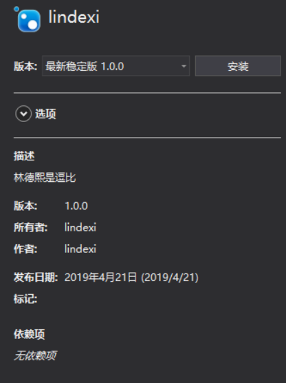

# Roslyn 通过 NuGet 库修改应用程序入口函数

我和小伙伴说只要你安装我的 NuGet 库无论你怎么做，都会调用我的 Main 函数，默认的主函数不会调用

<!--more-->
<!-- csdn -->
<!-- 标签：Roslyn,MSBuild,编译器 -->

在程序编译的时候可以通过指定 StartupObject 指定某个命名空间里面的某个类的主函数作为入口

在做 NuGet 包可以通过 Build 文件夹里面添加一些有趣的代码，简单的调试请创建一个简单的 Nuget 包，创建方法请看 [VisualStudio 使用新项目格式快速打出 Nuget 包](https://blog.lindexi.com/post/visualstudio-%E4%BD%BF%E7%94%A8%E6%96%B0%E9%A1%B9%E7%9B%AE%E6%A0%BC%E5%BC%8F%E5%BF%AB%E9%80%9F%E6%89%93%E5%87%BA-nuget-%E5%8C%85 )

在做一个 Nuget 包的时候可以直接纯手工写一个 nuget 包，或者修改现有的 Nuget 包文件

如我使用新项目格式打出一个 lindexi 的包，我通过安装本地nuget包

<!--  -->


安装完成可以在用户名的 .nuget 文件夹找到

```csharp
c:\Users\lindexi\.nuget\packages\lindexi\1.0.0\
```

在这个文件夹里面创建 Build 文件夹，在 Build 文件夹创建 `nuget 库的 id .targets` 文件，如我这里的是 lindexi 就创建 lindexi.targets 文件，此时看到的文件夹如下

```csharp
│  .nupkg.metadata
│  lindexi.1.0.0.nupkg
│  lindexi.1.0.0.nupkg.sha512
│  lindexi.nuspec
│
├─build
│      lindexi.targets
│
├─package
│  └─services
│      └─metadata
│          └─core-properties
└─_rels
```

在 lindexi.targets 文件里面可以尝试添加代码，在测试的项目每次都需要运行 git clean -xdf 清理之后才可以使用 dotnet run 运行，这样就可以减少打包

在 targets 文件里面写的内容，只需要下一次在测试项目使用 dotnet run 就会使用

先通过[WriteLinesToFile](https://blog.lindexi.com/post/roslyn-%E4%BD%BF%E7%94%A8-writelinestofile-%E8%A7%A3%E5%86%B3%E5%8F%82%E6%95%B0%E8%BF%87%E9%95%BF%E6%97%A0%E6%B3%95%E4%BC%A0%E5%85%A5 )写一个新的文件，这个文件里面包括主函数

然后在 `StartupObject` 指定入口函数为刚才创建的文件

在 targets 文件定义临时文件的存放的路径

```csharp
  <PropertyGroup>
    <_GeneratedEntryPointFile>$(IntermediateOutputPath)$(MSBuildProjectName).Program.g$(DefaultLanguageSourceExtension)</_GeneratedEntryPointFile>
  </PropertyGroup>
```
 
这里的 `$(IntermediateOutputPath)` 是常量，更多请看[项目文件中的已知属性（知道了这些，就不会随便在 csproj 中写死常量啦） - walterlv](https://blog.walterlv.com/post/known-properties-in-csproj.html )

上面代码是定义路径是 obj 文件夹的 xx.Program.g.cs 的文件

然后写入新的代码

```csharp
     <PropertyGroup>
         <_GeneratedProgramFileContent >

<![CDATA[
        // <auto-generated>This file was created automatically</auto-generated>
        using System;
        using System.Runtime.CompilerServices;

        namespace Lindexi
        {
            [CompilerGenerated]
            class Program
            {
                static void Main(string[] args)
                {
                    Console.WriteLine("林德熙是逗比");
                }
            }
        }
       
]]>

       </_GeneratedProgramFileContent>

    </PropertyGroup>
```

将代码写入到文件可以使用[WriteLinesToFile](https://blog.lindexi.com/post/roslyn-%E4%BD%BF%E7%94%A8-writelinestofile-%E8%A7%A3%E5%86%B3%E5%8F%82%E6%95%B0%E8%BF%87%E9%95%BF%E6%97%A0%E6%B3%95%E4%BC%A0%E5%85%A5 )写入到上面定义的文件

注意文件里面有逗号，在[Roslyn how to use WriteLinesToFile to write the semicolons to file](https://blog.lindexi.com/post/roslyn-how-to-use-writelinestofile-to-write-the-semicolons-to-file )告诉大家如何解决逗号的坑

```csharp
    <WriteLinesToFile File="$(_GeneratedEntryPointFile)"
                      Overwrite="true"
                      Lines="$([MSBuild]::Escape($(_GeneratedProgramFileContent)))"
                      Encoding="Unicode"/>
```

文件写入之后还需要添加文件到编译

```csharp
    <ItemGroup>
      <Compile Include="$(_GeneratedEntryPointFile)" />
    </ItemGroup>
```

因为文件需要编译，所以这个时机需要 CoreCompile 之前，需要设置启动项目为这个文件，全部代码有点长

```csharp
<Project>

  <PropertyGroup>
    <_GeneratedEntryPointFile>$(IntermediateOutputPath)$(MSBuildProjectName).Program.g$(DefaultLanguageSourceExtension)</_GeneratedEntryPointFile>
  </PropertyGroup>

  <Target Name="_GenerateRealEntryPointType"
          BeforeTargets="CoreCompile"
          DependsOnTargets="PrepareForBuild;CoreGenerateDragonFruitProgramFile"
          Condition="'$(DisableAutoGeneratedMain)' != 'true'">
    <PropertyGroup>
      <StartupObject>Lindexi.Program</StartupObject>
    </PropertyGroup>
  </Target>

  <Target Name="CoreGenerateDragonFruitProgramFile"
          Condition="'$(Language)' == 'C#'"
          Outputs="$(_GeneratedEntryPointFile)">

      <PropertyGroup>
         <_GeneratedProgramFileContent >

<![CDATA[
        // <auto-generated>This file was created automatically</auto-generated>
        using System;
        using System.Runtime.CompilerServices;

        namespace Lindexi
        {
            [CompilerGenerated]
            class Program
            {
                static void Main(string[] args)
                {
                    Console.WriteLine("林德熙是逗比");
                }
            }
        }
       
]]>

       </_GeneratedProgramFileContent>

    </PropertyGroup>

    <WriteLinesToFile File="$(_GeneratedEntryPointFile)"
                      Overwrite="true"
                      Lines="$([MSBuild]::Escape($(_GeneratedProgramFileContent)))"
                      Encoding="Unicode"/>

    <ItemGroup>
      <Compile Include="$(_GeneratedEntryPointFile)" />
    </ItemGroup>
  </Target>
</Project>
```

通过这个方法就可以修改应用程序的入口，将入口程序修改为特殊的，那么这样有什么用？在[System.CommandLine](https://github.com/dotnet/command-line-api)就使用这个方法让用户可以写出多个参数的主函数

关于[System.CommandLine](https://github.com/dotnet/command-line-api)请看[dotnet 使用 System.CommandLine 写命令行程序](https://blog.lindexi.com/post/dotnet-%E4%BD%BF%E7%94%A8-system.commandline-%E5%86%99%E5%91%BD%E4%BB%A4%E8%A1%8C%E7%A8%8B%E5%BA%8F )

更多编译相关请看[手把手教你写 Roslyn 修改编译](https://blog.lindexi.com/post/roslyn.html )

<a rel="license" href="http://creativecommons.org/licenses/by-nc-sa/4.0/"></a><br />本作品采用<a rel="license" href="http://creativecommons.org/licenses/by-nc-sa/4.0/">知识共享署名-非商业性使用-相同方式共享 4.0 国际许可协议</a>进行许可。欢迎转载、使用、重新发布，但务必保留文章署名[林德熙](http://blog.csdn.net/lindexi_gd)(包含链接:http://blog.csdn.net/lindexi_gd )，不得用于商业目的，基于本文修改后的作品务必以相同的许可发布。如有任何疑问，请与我[联系](mailto:lindexi_gd@163.com)。
