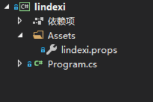
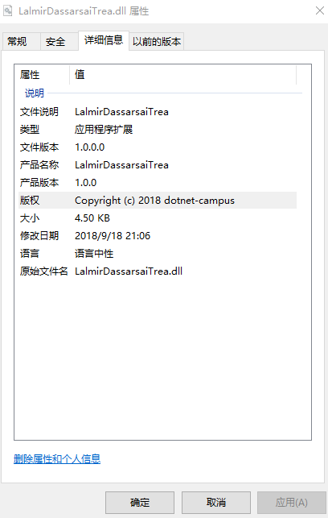

# Roslyn 通过 Nuget 管理公司配置

本文来告诉大家如何用 Roslyn 管理配置，在开一个新的项目的时候经常需要添加公司，版权等，但是这些信息不想每次都添加于是我就想用 Nuget 管理所有配置，安装一个 nuget 就自动配置

<!--more-->
<!-- csdn -->

我在公司很久都没开发过业务，我都是在做底层的库，于是我就需要创建很多个项目，只要我发现某个功能用到的一些代码可以在其他功能使用，我就会将这个代码抽到一个库。

在创建新的库的时候，我就需要添加下面配置

```
<Company>dotnet-campus</Company>
<Copyright>Copyright (c) 2018 dotnet-campus</Copyright>

```

在第二年的时候，我需要修改很多库的版权，修改为 2019 ，而从 VisualStudio 打开是很慢的，修改一个项目文件需要很长的时间

而且我的团队也有新人加入，我告诉他需要添加一些配置，但是每次的提交我都需要关注，是不是公司名没写对

最近我学到 Roslyn 的方法，通过 Nuget 添加配置，下面让我手把手告诉大家如何做一个配置。在上一篇文章[Roslyn 通过 nuget 统一管理信息](https://lindexi.oschina.io/lindexi/post/Roslyn-%E9%80%9A%E8%BF%87-nuget-%E7%BB%9F%E4%B8%80%E7%AE%A1%E7%90%86%E4%BF%A1%E6%81%AF.html )告诉了大家如何通过手动写文件的方式做一个 nuget 包，本文来告诉大家通过 VisualStudio 创建工程的方式打包。

对比两篇博客，会发现通过 VisualStudio 打包的方式会更加简单。

先通过 VisualStudio 创建一个 dotnet core 项目，这个项目实际不需要代码。

创建了一个项目之后需要在这个项目里面添加一些文件，假设创建的项目的名字是 lindexi 在这个项目创建 Assets 文件夹，然后在文件夹里面创建 lindexi.props 文件

<!--  -->


这个文件将会作为 nuget 安装时使用的文件，在里面就填写配置

```
<Project>
  <PropertyGroup>
    <Company>dotnet-campus</Company>
    <Owners>$(Company)</Owners>
    <Copyright>Copyright (c) 2018 dotnet-campus</Copyright>
  </PropertyGroup>
</Project>
```

这里的信息需要根据自己的需要写，通过这里写的内容就可以通过 nuget 安装到自己的项目

但是现在还不能做出一个 nuget 包，还需要在项目文件添加一些内容，右击工程点击编辑项目文件，在项目文件添加一些代码，请看下面代码

```
<Project Sdk="Microsoft.NET.Sdk">

  <PropertyGroup>
    <OutputType>Exe</OutputType>
    <TargetFramework>netcoreapp2.1</TargetFramework>
  </PropertyGroup>

  <ItemGroup>
    <None Include="Assets\**" Pack="True" PackagePath="build\" />
    <None Include="Assets\**" Pack="True" PackagePath="buildMultiTargeting\" />
  </ItemGroup>

</Project>

```

在上面的代码就是添加了 Assets 文件夹，请看下面代码

```
  <ItemGroup>
    <None Include="Assets\**" Pack="True" PackagePath="build\" />
    <None Include="Assets\**" Pack="True" PackagePath="buildMultiTargeting\" />
  </ItemGroup>
``` 

上面的代码的意思就是打包的时候添加 Assets 文件夹内的所有文件，在打包的时候添加到 build 和 buildMultiTargeting 文件夹下

现在右击项目打包就可以在 `bin\debug` 文件夹下找到 xx.1.0.0.nupkg 文件

<!--  -->


这个文件可以通过 Nuget Package Explorer 打开，这个软件可以在应用商店下载，点击[下载](https://www.microsoft.com/store/productId/9WZDNCRDMDM3 )

打开可以看到下面的文件，这里包含的 build 文件和 buildMultiTargeting 

<!--  -->


现在可以通过安装这个 nuget 包的方式，测试这个包是否可以使用。安装本地的 nuget 包的方式很简单，通过在 nuget 设置的方法，具体请看[Roslyn 通过 nuget 统一管理信息](https://lindexi.oschina.io/lindexi/post/Roslyn-%E9%80%9A%E8%BF%87-nuget-%E7%BB%9F%E4%B8%80%E7%AE%A1%E7%90%86%E4%BF%A1%E6%81%AF.html )

这时我创建了一个新的 dotnet core 项目，然后在这个项目安装这个包，通过这个方式编译出来的文件，右击属性就可以发现这个 dll 的信息已经包含了。

<!--  -->


当前现在还没做完，如果这时创建了一个 dotnet framework 4.5 的项目，会发现这个包无法安装，因为这个包的依赖是 dotnet core 2.1 ，所以需要添加一些代码让这个包可以在 dotnet framework 使用

右击编辑项目文件，修改 TargetFramework 为多个，请看代码

```
<Project Sdk="Microsoft.NET.Sdk">

  <PropertyGroup>
    <OutputType>Exe</OutputType>
    <TargetFrameworks>netcoreapp2.0;net35</TargetFrameworks>
    <Version>1.6.0</Version>
    <Description>林德熙是逗比</Description>
  </PropertyGroup>

  <ItemGroup>
    <None Include="Assets\**" Pack="True" PackagePath="build\" />
    <None Include="Assets\**" Pack="True" PackagePath="buildMultiTargeting\" />
  </ItemGroup>

</Project>

```

这里将原来的 TargetFramework 修改为 TargetFrameworks 添加了其他的框架，具体可以使用的请看[从以前的项目格式迁移到 VS2017 新项目格式](https://lindexi.gitee.io/post/%E4%BB%8E%E4%BB%A5%E5%89%8D%E7%9A%84%E9%A1%B9%E7%9B%AE%E6%A0%BC%E5%BC%8F%E8%BF%81%E7%A7%BB%E5%88%B0-VS2017-%E6%96%B0%E9%A1%B9%E7%9B%AE%E6%A0%BC%E5%BC%8F.html )

现在打出来的包还有影响到安装这个包的项目，还需要在项目文件做一些更改，请看代码

```
    <IsTool>true</IsTool>
    <NoPackageAnalysis>true</NoPackageAnalysis>
    <GeneratePackageOnBuild>true</GeneratePackageOnBuild>
    <NoBuild>true</NoBuild>
    <IncludeBuildOutput>false</IncludeBuildOutput>
```

具体上面的代码的意思请看[项目文件中的已知 NuGet 属性（使用这些属性，创建 NuGet 包就可以不需要 nuspec 文件啦） - walterlv](https://walterlv.com/post/known-nuget-properties-in-csproj.html )

[从以前的项目格式迁移到 VS2017 新项目格式](https://lindexi.gitee.io/post/%E4%BB%8E%E4%BB%A5%E5%89%8D%E7%9A%84%E9%A1%B9%E7%9B%AE%E6%A0%BC%E5%BC%8F%E8%BF%81%E7%A7%BB%E5%88%B0-VS2017-%E6%96%B0%E9%A1%B9%E7%9B%AE%E6%A0%BC%E5%BC%8F.html )

[Roslyn 通过 nuget 统一管理信息](https://lindexi.oschina.io/lindexi/post/Roslyn-%E9%80%9A%E8%BF%87-nuget-%E7%BB%9F%E4%B8%80%E7%AE%A1%E7%90%86%E4%BF%A1%E6%81%AF.html ) 

<a rel="license" href="http://creativecommons.org/licenses/by-nc-sa/4.0/"></a><br />本作品采用<a rel="license" href="http://creativecommons.org/licenses/by-nc-sa/4.0/">知识共享署名-非商业性使用-相同方式共享 4.0 国际许可协议</a>进行许可。欢迎转载、使用、重新发布，但务必保留文章署名[林德熙](http://blog.csdn.net/lindexi_gd)(包含链接:http://blog.csdn.net/lindexi_gd )，不得用于商业目的，基于本文修改后的作品务必以相同的许可发布。如有任何疑问，请与我[联系](mailto:lindexi_gd@163.com)。
