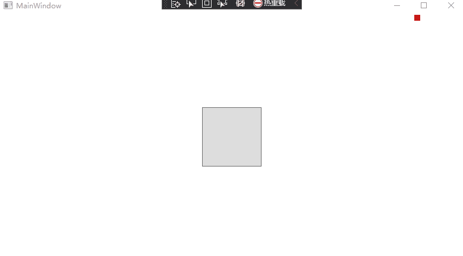

# VisualStudio 调试时会不断刷新 WPF 应用渲染

在 VisualStudio 附加调试和没有用 VisualStudio 附加调试时，对应用程序是有不同的影响，如 VisualStudio 设计器将会在附加调试 WPF 应用的时候，不断刷新 WPF 应用的渲染。也就是说，如果你觉得界面视觉效果不对或者对，也许可以甩锅到 VisualStudio 上

<!--more-->
<!-- CreateTime:2021/8/5 18:03:06 -->


<!-- 发布 -->

在上一篇博客告诉大家，在 WPF 中更改 DrawingVisual 的 RenderOpen 用到的对象的内容将持续影响渲染效果，详细请看 [WPF 更改 DrawingVisual 的 RenderOpen 用到的对象的内容将持续影响渲染效果](https://blog.lindexi.com/post/WPF-%E6%9B%B4%E6%94%B9-DrawingVisual-%E7%9A%84-RenderOpen-%E7%94%A8%E5%88%B0%E7%9A%84%E5%AF%B9%E8%B1%A1%E7%9A%84%E5%86%85%E5%AE%B9%E5%B0%86%E6%8C%81%E7%BB%AD%E5%BD%B1%E5%93%8D%E6%B8%B2%E6%9F%93%E6%95%88%E6%9E%9C.html )

通过以下简单的逻辑可以实现一个矩形动画的功能

```csharp
        private async void SetTranslateTransform(TranslateTransform translateTransform)
        {
            while (true)
            {
                translateTransform.X++;

                if (translateTransform.X > 700)
                {
                    translateTransform.X = 0;
                }

                await Task.Delay(TimeSpan.FromMilliseconds(10));
            }
        }
```

在 VisualStudio 附加调试下的视觉效果如下图，可以播放动画

<!--  -->


然而有趣的是，在 VisualStudio 不附加调试的时候，可以发现界面不动了，如下图。下图非静止图片哦


如果在不附加调试时，有界面刷新时，那么依然还会动画。如上图，在鼠标在按钮上时，此时按钮界面需要刷新，于是触发了渲染。在触发渲染时，在收集的时候，重新拿到了 TranslateTransform 的值，矩形的渲染坐标更改

通过上面的例子可以看到，在附加 VisualStudio 调试时，界面将不断触发渲染，有时的动画效果就是在附加 VisualStudio 调试时看起来才是对的，或者看起来不对。因此在编写效果，需要在干掉 VisualStudio 调试看一下效果

本文所有代码放在 [github](https://github.com/lindexi/lindexi_gd/tree/2af349867a6e6da136e5bc068357877f38788216/KebelrafoRalneanarjeargi) 和 [gitee](https://gitee.com/lindexi/lindexi_gd/tree/2af349867a6e6da136e5bc068357877f38788216/KebelrafoRalneanarjeargi) 欢迎小伙伴访问

可以通过如下方式获取本文的源代码，先创建一个空文件夹，接着使用命令行 cd 命令进入此空文件夹，在命令行里面输入以下代码，即可获取到本文的代码

```
git init
git remote add origin https://gitee.com/lindexi/lindexi_gd.git
git pull origin 2af349867a6e6da136e5bc068357877f38788216
```

以上使用的是 gitee 的源，如果 gitee 不能访问，请替换为 github 的源

```
git remote remove origin
git remote add origin https://github.com/lindexi/lindexi_gd.git
```

获取代码之后，进入 KebelrafoRalneanarjeargi 文件夹

通过调试 VisualStudio 和 WPF 的源代码可以了解到为什么在附加调试的时候将会不断刷新

在 WPF 里面，大部分的界面刷新都由 `MediaContext.PostRender` 触发。而 `MediaContext.PostRender` 函数在大部分依赖属性变更的时候都会触发（取决于依赖属性的定义哈，是否要刷新界面或重新布局等）而可以认为大部分界面刷新也由依赖属性变更而触发

在 VisualStudio 2019 时，微软给出了新功能，实时可视化树调试。此工具有一个功能是附加到当前调试的窗口上，在调试的时候，给当前调试的应用添加一个工具栏或者加上调试使用的界面。此时调试的工具是注入到当前正在调试的应用的代码实现的，此工具也是由 WPF 编写的。刚好在 VisualStudio 调试器里面有这样的逻辑，不断更新调试的工具的某些依赖属性。因为 VisualStudio 代码是没有开源的，我也不想去了解细节，因此本文只是告诉大家 VisualStudio 有这个行为

在 VisualStudio 调试工具更新依赖属性的时候，将会触发元素的重新布局，从而触发 `MediaContext.PostRender` 方法，此时界面将会刷新。这就是为什么通过 VisualStudio 附加调试的时候，将会不断刷新 WPF 渲染的原因

<a rel="license" href="http://creativecommons.org/licenses/by-nc-sa/4.0/"></a><br />本作品采用<a rel="license" href="http://creativecommons.org/licenses/by-nc-sa/4.0/">知识共享署名-非商业性使用-相同方式共享 4.0 国际许可协议</a>进行许可。欢迎转载、使用、重新发布，但务必保留文章署名[林德熙](http://blog.csdn.net/lindexi_gd)(包含链接:http://blog.csdn.net/lindexi_gd )，不得用于商业目的，基于本文修改后的作品务必以相同的许可发布。如有任何疑问，请与我[联系](mailto:lindexi_gd@163.com)。
