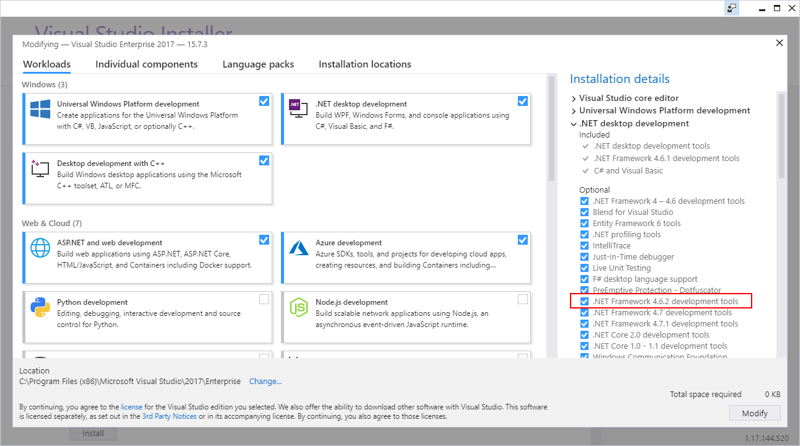
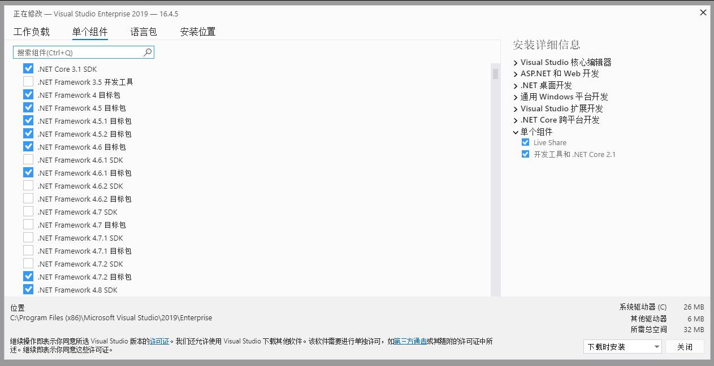
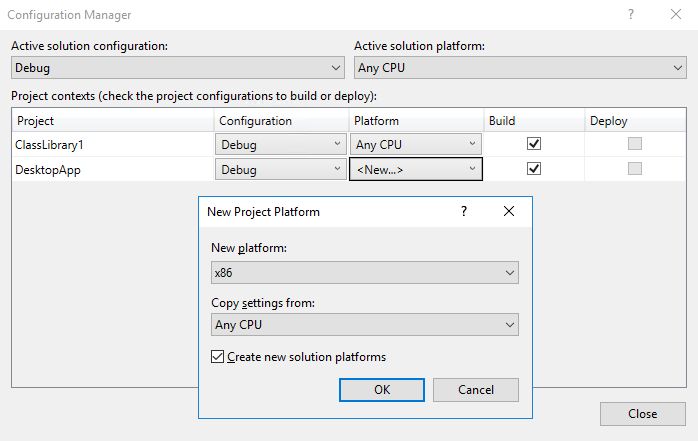

# WPF dotnet 使用本机映像 native 优化 dotnet framework 二进制文件

在 2017 我在社区问了一个问题，如何让 .NET Framework 的 WPF 等程序使用 .NET Native 构建以提升速度。在 2019.06 的时候，强大的微软提供了一个好用的库，支持将 .NET Framework 的桌面应用构建时添加 native images 本机映像支持

<!--more-->
<!-- 发布 -->

咱可以通过预编译咱的二进制文件来提升 .NET Framework 应用的启动时间。推荐使用技术用来在大型的应用的打包和分发上或上架到微软应用商店。微软官方测试表示这个技术大概能提升 20% 的性能。这项技术用到了 ReadyToRun 技术，详细请看 [coreclr/readytorun-overview.md at master · dotnet/coreclr](https://github.com/dotnet/coreclr/blob/master/Documentation/botr/readytorun-overview.md )

微软将这个本机映像编译器作为一个 [NuGet](https://www.nuget.org/packages/Microsoft.DotNet.Framework.NativeImageCompiler) 库发布，可以从 [https://www.nuget.org/packages/Microsoft.DotNet.Framework.NativeImageCompiler](https://www.nuget.org/packages/Microsoft.DotNet.Framework.NativeImageCompiler) 下载。这个库适用于 .NET Framework 大于等于 4.6.2 的应用。这个包的作用是在构建时添加一个步骤，这个步骤的作用是构建本机映像二进制文件。这个优化将会在应用在安装了 .NET Framework 4.7.2 和以上的设备运行时被使用，而之前的版本的设备将继续使用 MSIL 代码执行，换句话说，想要使用这个特性优化的，只有运行在安装了 .NET Framework 4.7.2 和以上的设备，对之前的设备依然运行优化之前的代码

在 Windows 10 的 Windows 10 April 2018 更新包含了 .NET Framework 4.7.2 的预安装。咱也可以手动在 Windows 7 以上的设备或 Windows Server 2008 R2 以上的设备安装 .NET framework 4.7.2 版本

如果想要用本机映像优化技术优化打包的项目，将使用 UWP 打包 Win32 应用，请记得选择 UWP 的最低版本是基于 Windows Anniversary Update 版本

## 如何创建本机映像

需要对咱的项目进行以下配置：

1. 设置目标的框架平台是 4.6.2 或以上
2. 配置目标平台是 x86 或 x64 换句话说是不要设置为 AnyCpu 的
3. 添加一个神奇的 NuGet 库
4. 使用 Release 构建

## 设置目标的框架平台是 4.6.2 或以上

在设置 .NET Framework 到 4.6.2 或以上之前，需要先安装 .NET Framework 4.6.2 开发者工具包。这个工具包可以在 VisualStudio 安装器里面作为一个工作负载进行安装:

<!--  -->


<!-- 以上是[官方文档](https://docs.microsoft.com/zh-cn/windows/msix/desktop/desktop-to-uwp-r2r) 提供的图片，而最新的 VisualStudio 2019 的设置如下图 -->

<!--  -->

或者从 [https://dotnet.microsoft.com/download/visual-studio-sdks](https://dotnet.microsoft.com/download/visual-studio-sdks) 下载安装

## 配置目标平台是 x86 或 x64 平台

本机映像编译器需要根据给定的平台优化代码。为了使用本机映像编译器就需要配置自己的项目特别为 x86 或 x64 构建

如果一个解决方案里面包含了多个项目，只需要设置入口项目，也就是启动项目作为 x86 或 x64 进行构建。其他的被引用的项目将会根据主项目的配置进行优化，即使这些项目设置是 AnyCPU 平台

设置项目方法如下：

1. 右击解决方案，选择配置方案管理器
2. 下拉平台里面的入口项目的配置，点击新建按钮
3. 在新建项目平台弹出界面里面，新建 x86 和 x64 平台，请确保勾选了从 AnyCPU 复制选项

<!--  -->


中文版界面请看下图

<!--  -->


注意，设置为 AnyCPU 不支持使用本机映像编译器构建

## 添加 NuGet 包

这个本机映像编译器是通过 NuGet 包分发，可以通过在 WPF 或 WinForms 等项目添加 [Microsoft.DotNet.Framework.NativeImageCompiler](https://www.nuget.org/packages/Microsoft.DotNet.Framework.NativeImageCompiler) 库的方式让项目使用本机映像编译器优化。可以在 PowerShell 中输入下面代码安装

```csharp
PM> Install-Package Microsoft.DotNet.Framework.NativeImageCompiler -Version 1.0.0
```

## 创建一个 Release 构建

在上一步安装的 NuGet 库将作为一个附加的工具在构建项目时运行。这个工具将会在相同的输出二进制文件里面添加二进制代码。为了确认这个工具已经优化了咱的二进制文件，可以通过在构建时的输出寻找下面代码

```csharp
Native image obj\x86\Release\\R2R\DesktopApp1.exe generated successfully.
```

默认在 VisualStudio 输出中是看不到上面代码，需要打开开发者命令行工具，也就是告诉 Cortana 打开 开发者命令行工具，在命令行工具里面输入下面代码构建

```csharp
msbuild /p:configuration="release"
```

此时将可以在输出看到 RunNgenR2R 任务

```
RunNgenR2R:
  正在创建目录“obj\Release\net462\\R2R”。
  C:\Users\lindexi\.nuget\packages\runtime.win10-x86.microsoft.dotnet.framework.nativeimagecompiler\1.0.0\build\net462\..
  \..\tools\NgenR2R.exe "@obj\Release\net462\\R2R\WenabemchicargeQunallburhawwi.rsp"
  Microsoft (R) CLR Native Image Generator - Version 4.8.3761.0
  Copyright (c) Microsoft Corporation.  All rights reserved.

  Loading C:\Users\lindexi\.nuget\packages\runtime.win10-x86.microsoft.dotnet.framework.nativeimagecompiler\1.0.0\tools\r
  ef\mscorlib.dll
  Loading C:\lindexi\WenabemchicargeQunallburhawwi\WenabemchicargeQunallburhawwi\obj\Release\net462\
  WenabemchicargeQunallburhawwi.exe
  Loading C:\Users\lindexi\.nuget\packages\runtime.win10-x86.microsoft.dotnet.framework.nativeimagecompiler\1.0.0\tools\r
  ef\PresentationFramework.dll
  Loading C:\Users\lindexi\.nuget\packages\runtime.win10-x86.microsoft.dotnet.framework.nativeimagecompiler\1.0.0\tools\r
  ef\WindowsBase.dll
  Loading C:\Users\lindexi\.nuget\packages\runtime.win10-x86.microsoft.dotnet.framework.nativeimagecompiler\1.0.0\tools\r
  ef\System.Xaml.dll
  Loading C:\Users\lindexi\.nuget\packages\runtime.win10-x86.microsoft.dotnet.framework.nativeimagecompiler\1.0.0\tools\r
  ef\PresentationCore.dll
  Loading C:\Users\lindexi\.nuget\packages\runtime.win10-x86.microsoft.dotnet.framework.nativeimagecompiler\1.0.0\tools\r
  ef\System.dll
  Loading C:\Users\lindexi\.nuget\packages\runtime.win10-x86.microsoft.dotnet.framework.nativeimagecompiler\1.0.0\tools\r
  ef\UIAutomationTypes.dll
  Native image obj\Release\net462\\R2R\WenabemchicargeQunallburhawwi.exe generated successfully.
```

本文代码放在 [github](https://github.com/lindexi/lindexi_gd/tree/af04ec5ddcb5643d4472b87645894ddebd30dc6f/WenabemchicargeQunallburhawwi) 欢迎小伙伴访问

详细请看[官方文档](https://docs.microsoft.com/zh-cn/windows/msix/desktop/desktop-to-uwp-r2r)

## FAQ

Q: 如果这个新构建出来的二进制文件在没有安装 .NET Framework 4.7.2 或以上的设备上运行会如何？

A: 这个优化的二进制文件的优化只有在安装 .NET Framework 4.7.2 或以上的设备才能运行优化版，而对于没有安装 .NET Framework 4.7.2 或以上的设备会执行 MSIL 代码版，也就是此优化只对 4.7.2 或以上的设备有效

Q: 使用中遇到问题或反馈可以在哪里反馈？

A: 可以点击 VisualStudio 的右上角的反馈按钮反馈，详细请看 [如何报告 Visual Studio 的问题](https://docs.microsoft.com/zh-cn/visualstudio/ide/how-to-report-a-problem-with-visual-studio?view=vs-2019 )

Q: 这个优化的本机映像对原有的二进制文件影响是什么？

A: 这个优化的二进制文件将包含托管代码和本机代码，会让最终输出的文件更大

Q: 我是否可以在项目中使用这个技术？

A: 这个版本包含了 Go Live license 也就是咱现在就能用

什么是 Go Live license 请看 [Roslyn ships v1.0-rc2 with "Go-Live" license](https://devblogs.microsoft.com/vbteam/roslyn-ships-v1-0-rc2-with-go-live-license/ )
 
<a rel="license" href="http://creativecommons.org/licenses/by-nc-sa/4.0/"></a><br />本作品采用<a rel="license" href="http://creativecommons.org/licenses/by-nc-sa/4.0/">知识共享署名-非商业性使用-相同方式共享 4.0 国际许可协议</a>进行许可。欢迎转载、使用、重新发布，但务必保留文章署名[林德熙](http://blog.csdn.net/lindexi_gd)(包含链接:http://blog.csdn.net/lindexi_gd )，不得用于商业目的，基于本文修改后的作品务必以相同的许可发布。如有任何疑问，请与我[联系](mailto:lindexi_gd@163.com)。
