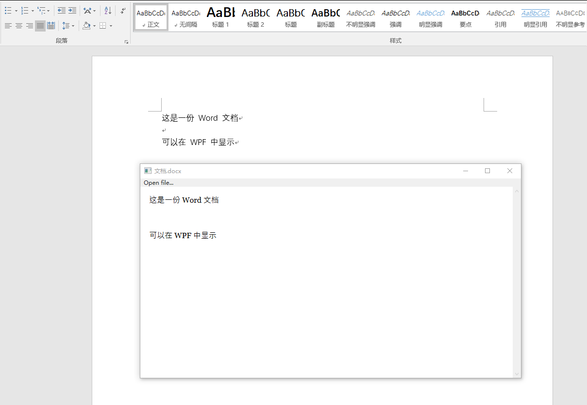

# WPF 将 docx 的 Word 文件转换为 FlowDocument 显示

本文告诉大家如何将 docx 的 Word 文档在 WPF 中显示内容

<!--more-->
<!-- 发布 -->

本文源代码请看 [ArtMalykhin/wpf-embedded-docx](https://github.com/ArtMalykhin/wpf-embedded-docx )

在 [Office 文档解析 文档格式和协议](https://lindexi.gitee.io/post/Office-%E6%96%87%E6%A1%A3%E8%A7%A3%E6%9E%90-%E6%96%87%E6%A1%A3%E6%A0%BC%E5%BC%8F%E5%92%8C%E5%8D%8F%E8%AE%AE.html ) 咱可以了解到 Word 文档只是一个压缩文件里面的文件使用 xml 表示

因此需要做的是将 xml 转 FlowDocument 在 WPF 界面显示，大概做到的效果就是丢失很多样式和特效，然后文本形式加超链接在 WPF 显示的效果

<!--  -->

详细请看 [Show Word File in WPF - CodeProject](https://www.codeproject.com/Articles/649064/Show-Word-file-in-WPF )

 本作品采用<a rel="license" href="http://creativecommons.org/licenses/by-nc-sa/4.0/">知识共享署名-非商业性使用-相同方式共享 4.0 国际许可协议</a>进行许可。欢迎转载、使用、重新发布，但务必保留文章署名[林德熙](http://blog.csdn.net/lindexi_gd)(包含链接:http://blog.csdn.net/lindexi_gd )，不得用于商业目的，基于本文修改后的作品务必以相同的许可发布。如有任何疑问，请与我[联系](mailto:lindexi_gd@163.com)。
