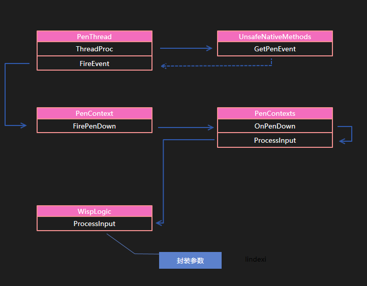
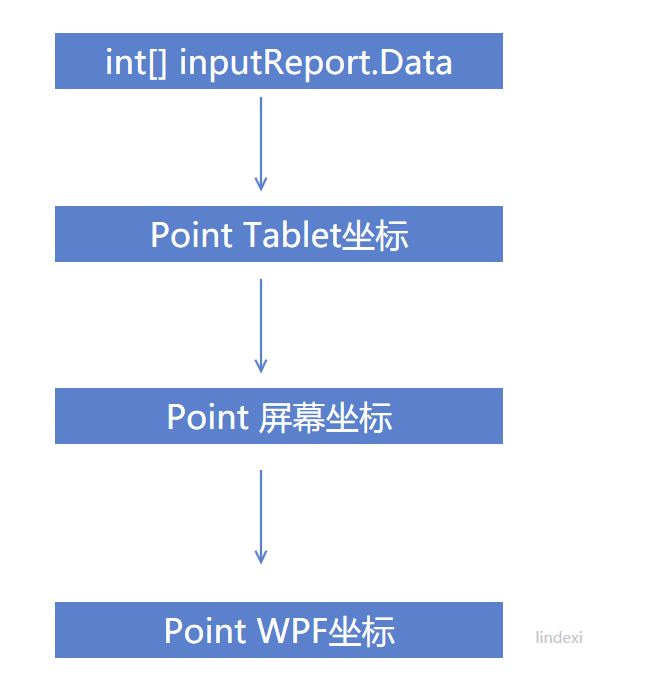

# WPF 高速书写 StylusPlugIn 原理

本文告诉大家 WPF 的 StylusPlugIn 为什么能做高性能书写，在我的上一篇博客和大家介绍了 WPF 的触摸原理，但是没有详细告诉大家如何通过触摸原理知道如何去做一个高速获得触摸的应用，所以本文就在上一篇博客的基础继续告诉大家底层的原理

如果觉得原理很无论，就直接关闭本文，因为本文都是理论，不会告诉大家如何做高性能书写

<!--more-->
<!-- csdn -->

在 WPF 如果想要做高性能的书写，就需要足够快获得用户的触摸输入，而如果直接拿到的是路由的输入就会存在下面的问题

- 主线程卡住了

- 主线程没有全力处理触摸笔迹

- 路由事件本身的耗时

- 元素多了路由事件就需要经过很多的元素

在用户触摸屏幕的时候，会在 `PenThreadWorker.ThreadProc` 里面的 `UnsafeNativeMethods.GetPenEvent` 或 `UnsafeNativeMethods.GetPenEventMultiple` 拿到触摸的消息，从而调用 `PenThreadWorker.FireEvent` 调用 `PenContext` 的对应的方法，从 [WPF 触摸到事件](https://lindexi.gitee.io/post/WPF-%E8%A7%A6%E6%91%B8%E5%88%B0%E4%BA%8B%E4%BB%B6.html ) 可以看到，从 `PenThreadWorker.ThreadProc` 到 `PenThreadWorker.FireEvent`  的过程

<!--  -->


这里需要补充一下，从  `PenThreadWorker.FireEvent` 可以调用 PenContext 三个不同的方法，分别是 FirePenDown 、FirePackets、FirePenUp 而这几个方法最后都会调用到 `WispLogic.ProcessInput` 方法。在 `WispLogic.ProcessInput` 经过封装调用 `WispLogic.ProcessInputReport`  在这个函数里面就会执行所有的 StylusPlugin 请看代码

```csharp
		private void ProcessInputReport(RawStylusInputReport inputReport)
		{
			WispStylusDevice wispStylusDevice = this.FindStylusDeviceWithLock(inputReport.StylusDeviceId);
			inputReport.StylusDevice = ((wispStylusDevice != null) ? wispStylusDevice.StylusDevice : null);
			if (!this._inDragDrop || !inputReport.PenContext.Contexts.IsWindowDisabled)
			{
				this.InvokeStylusPluginCollection(inputReport);
			}
			this.CoalesceAndQueueStylusEvent(inputReport);
		}
```

从上面代码可以看到 `InvokeStylusPluginCollection` 就是运行 StylusPlugin 集合，这里会调用所有的 StylusPlugin 类

那么 WPF 怎么知道当前的程序有哪些 StylusPlugin 可以被调用，下面先从如何寻找开始说

在 `PenContexts.InvokeStylusPluginCollection` 函数会调用 `PenContexts.TargetPlugInCollection` 函数拿到所有可以调用的 `StylusPlugInCollection` 进行运行。

在 `PenContexts.TargetPlugInCollection` 会先尝试拿到已经捕获的 PlugInCollection 进行返回，只有在没有拿到的时候才会执行 `HittestPlugInCollection` 先来看一下 TargetPlugInCollection 的代码，下面的代码被我删除了大部分无关的代码

```csharp
		internal StylusPlugInCollection TargetPlugInCollection(RawStylusInputReport inputReport)
		{
			var wispStylusDevice = inputReport.StylusDevice.As<WispStylusDevice>();
			
			// We're on the pen thread so can't touch visual tree.  Use capturedPlugIn (if capture on) or cached rects.
			// 现在是 Pen 的线程不在主线程，无法直接访问到视觉树
			StylusPlugInCollection stylusPlugInCollection = wispStylusDevice.GetCapturedPlugInCollection(our bool elementHasCapture);

			// 没有拿到值的时候就使用 HittestPlugInCollection 函数
			if (!elementHasCapture)
			{
				int[] data = inputReport.Data;
				// 下面这句话是被简化，会在本文下面仔细说明
				Point point = new Point((double)data[xx], (double)data[xx]);

				stylusPlugInCollection = this.HittestPlugInCollection(point);
			}
			
			return stylusPlugInCollection;
		}
```

那么 `WispStylusDevice.GetCapturedPlugInCollection` 是如何寻找可以返回的 StylusPlugInCollection 的值，下面请看 GetCapturedPlugInCollection 代码

```csharp
    internal override StylusPlugInCollection GetCapturedPlugInCollection(ref bool elementHasCapture)
    {
        elementHasCapture = _stylusCapture != null;
        return _stylusCapturePlugInCollection;
    }
```

可以看到 GetCapturedPlugInCollection 的代码非常简单，只是返回 `_stylusCapturePlugInCollection` 的值，关于 `_stylusCapturePlugInCollection` 的设置是在  `WispStylusDevice.ChangeStylusCapture` 函数进行设置，至于是什么时候才进行设置，就暂时跳过

这个做法是因为用户可以设置 xx 元素捕获输入，于是无论在哪里按下都需要触发捕获的元素，而忽略了命中到的元素。

一般是无法从 `WispStylusDevice.GetCapturedPlugInCollection` 返回值的，所以就需要使用 `inputReport.Data` 转换点，通过点来做命中测试，找到命中的元素 

从 TargetPlugInCollection 方法可以看到如何转换  inputReport.Data 为点，这里的  inputReport.Data 是 `int[]` 类，通过下面的方法可以转换为点，也就是替换上面的 `Point point = new Point((double)data[xx], (double)data[xx]);` 方法

```csharp
int inputArrayLengthPerPoint = inputReport.PenContext.StylusPointDescription.GetInputArrayLengthPerPoint();
int[] data = inputReport.Data;
Point point = new Point((double)data[data.Length - inputArrayLengthPerPoint], (double)data[data.Length - inputArrayLengthPerPoint + 1]);
```

大概 GetInputArrayLengthPerPoint 的代码是

```csharp
        /// <summary>
        /// Internal helper for determining how many ints in a raw int array 
        /// correspond to one point we get from the input system
        /// </summary>
        internal int GetInputArrayLengthPerPoint()
        { 
            int buttonLength = _buttonCount > 0 ? 1 : 0;
            int propertyLength = (_stylusPointPropertyInfos.Length - _buttonCount) + buttonLength; 
            if (!this.ContainsTruePressure) 
            {
                propertyLength--; 
            }
            return propertyLength;
        }
```

暂时就认为通过这个方法可以将转换为点，但是在转换之后需要将这个点换为 WPF 坐标，转为 WPF 坐标之前需要先将点转屏幕坐标，通过屏幕坐标转 WPF 坐标

<!--  -->


然后调用 HittestPlugInCollection 找到命中的 stylusPlugInCollection 这里的命中测试和 WPF 的元素命中测试不相同，在于即使有元素挡住也会命中

<!--  -->


```csharp
        StylusPlugInCollection HittestPlugInCollection(Point pt)
        {
            foreach (StylusPlugInCollection plugInCollection in _plugInCollectionList)
            { 
                if (plugInCollection.IsHit(pt)) 
                {
                    return plugInCollection; 
                }
            }
 
            return null; 
        }
```

这里的 `_plugInCollectionList` 就是 PenContexts 收集到的所有添加到 UIElement 的 StylusPlugIn 列表，这个值在 `PenContexts.AddStylusPlugInCollection` 添加了所有添加在 UIElement 的元素

关于 `PenContexts.AddStylusPlugInCollection` 在什么时候被调用，请看下面，这里的调用逻辑还是比较复杂，现在先假设已经添加了 `_plugInCollectionList` 只需要对里面的元素计算


在默认的 UIElement 是不创建 StylusPlugInCollection 的，只有在第一次使用 StylusPlugInCollection 的时候才会创建，创建的时候 StylusPlugInCollection 的构造函数需要传入创建的 UIElement 而添加对应的  StylusPlugIn 就是在对应的 UIElement 的创建的构造函数添加记录本地的 `_element = element` 这里还不添加事件

因为可能有无聊的用户只是拿一下 `UIElement.StylusPlugInCollection` 这里是不需要做什么只是创建一个类记录对应的元素

而实际上在加入到 `PenContexts._plugInCollectionList` 的过程还不是直接的添加，在用户调用 `StylusPlugIns.Add(new StylusPlugIn());` 的时候，调用 StylusPlugInCollection 重写的 InsertItem 函数

这个函数有一个很重要的是，虽然在使用 `StylusPlugIn` 是在另一个线程，但是在添加到元素的时候必须在主线程，因为在 InsertItem 的第一句就是判断元素是否在这个线程可以拿到

```csharp
public class StylusPlugInCollection : Collection<StylusPlugIn>
{
        protected override void InsertItem(int index, StylusPlugIn plugIn)
		{
			this._element.VerifyAccess();
            // 你以为下面就没代码了？
		}
}
```

在 InsertItem 会调用主要的函数 EnsureEventsHooked 在这个函数才是添加事件的函数，这样做是为了防止用户只是去拿 StylusPlugInCollection 就添加了事件，在主线程如果添加了很多事件，会让主线程运行被太多的事件拖慢，所以代码就在真的进行插入的时候才添加事件

这里为什么需要添加事件？因为在元素的可视化变化就需要修改属性，请看添加的事件

```csharp
                _element.IsEnabledChanged += _isEnabledChangedEventHandler; 
                _element.IsVisibleChanged += _isVisibleChangedEventHandler;
                _element.IsHitTestVisibleChanged += _isHitTestVisibleChangedEventHandler; 
                PresentationSource.AddSourceChangedHandler(_element, _sourceChangedEventHandler);  // has a security linkdemand
                _element.LayoutUpdated += _layoutChangedEventHandler;
```

监听了这么多事件是在做什么？下面一一列举出来，直接给代码

```csharp
        private void OnIsEnabledChanged(object sender, DependencyPropertyChangedEventArgs e) 
        {
            UpdatePenContextsState();
        } 
 
        private void OnIsVisibleChanged(object sender, DependencyPropertyChangedEventArgs e) 
        { 
            UpdatePenContextsState(); 
        }
 
        private void OnIsHitTestVisibleChanged(object sender, DependencyPropertyChangedEventArgs e)
        { 
            UpdatePenContextsState(); 
        } 
 
        private void OnRenderTransformChanged(object sender, EventArgs e) 
        {
            OnLayoutUpdated(sender, e);
        }
  
        private void OnSourceChanged(object sender, SourceChangedEventArgs e)
        { 
            // This means that the element has been added or remvoed from its source. 
            UpdatePenContextsState();
        } 
```

从上面可以看到是在调用 `UpdatePenContextsState` 函数，在 InsertItem 实际也是调用了这个函数，请看代码

```csharp
        protected override void InsertItem(int index, StylusPlugIn plugIn)
        {
        	EnsureEventsHooked();
        	base.InsertItem(index, plugIn); 
        	plugIn.Added(this);
            UpdatePenContextsState(); // Add to PenContexts if element is in proper state (can fire isactiveforinput). 
        }
```

在 UpdatePenContextsState 会将插入的 plugIn 放到 `PenContexts._plugInCollectionList` 但不是直接加入
，在加入之前需要从元素拿到元素的输入

```csharp
private void UpdatePenContextsState()
{
	PresentationSource presentationSource = PresentationSource.CriticalFromVisual(_element as Visual);
	InputManager inputManager = (InputManager)_element.Dispatcher.InputManager;
    PenContexts penContexts = inputManager.StylusLogic.GetPenContextsFromHwnd(presentationSource); 
    // 下面还有一半
}
```

从元素拿到 inputManager 从 inputManager 拿到 PenContexts 也就是如果这个多个元素使用不同的输入是可以的，可以自己创建一个输入让元素放在创建的线程

需要说的是，这里的代码是 .NET 4.6.2 和之前的代码，最新的代码是将 `UpdatePenContextsState` 放在基类，原因是存在了两个 StylusPlugInCollectionBase 这里在后面会说到

在下面就是将 StylusPlugInCollection 加入到 penContexts 直接的代码是

```csharp
 penContexts.AddStylusPlugInCollection(this);
```

实际上的代码是很多的，但是都是不需要关注的代码

这样在一开始添加就调用了 UpdatePenContextsState 如果在元素还没加入视觉树还没初始化，就会在元素的事件添加到 penContexts 如果元素发生了修改，也调用这个方法更新

这里可以学到的是，事件是只有在需要的时候才添加，而不是一开始就添加事件，然后在事件里面判断条件，这样可以防止事件因为添加太多，在做很小的事情都需要调用很多方法

## 迁移的 StylusPlugInCollection 方法

如果反编译 .NET 4.7 是看不到 StylusPlugInCollection 的 UpdatePenContextsState 方法，这时不要以为我是在乱写，这里的方法是通过调用字段的方法来做

在 `_stylusPlugInCollectionImpl.UpdateState` 就是做原来 UpdatePenContextsState 的方法

在最新的代码是在 StylusPlugInCollection 需要创建 StylusPlugInCollectionBase 类

```csharp
		internal StylusPlugInCollection(UIElement element)
		{
			this._stylusPlugInCollectionImpl = StylusPlugInCollectionBase.Create(this);
			
		}
```

这样做是因为 .NET 4.7 可以使用 Pointer 消息需要 PointerStylusPlugInCollection 类

```csharp
		internal static StylusPlugInCollectionBase Create(StylusPlugInCollection wrapper)
		{
			StylusPlugInCollectionBase stylusPlugInCollectionBase;
			if (StylusLogic.IsPointerStackEnabled)
			{
				stylusPlugInCollectionBase = new PointerStylusPlugInCollection();
			}
			else
			{
				stylusPlugInCollectionBase = new WispStylusPlugInCollection();
			}
			stylusPlugInCollectionBase.Wrapper = wrapper;
			return stylusPlugInCollectionBase;
		}
```

将原来的 StylusPlugInCollection 的 UpdatePenContextsState 分为 stylusPlugInCollectionBase 的 UpdateState 方法

在 WispStylusPlugInCollection 、 PointerStylusPlugInCollection 调用 UpdateState 和  StylusPlugInCollection 的 UpdatePenContextsState 方法差不多，所以本文就使用 UpdatePenContextsState 和大家说

## 代码

### PenContexts.TargetPlugInCollection

```csharp
       /// <securitynote>
        /// Critical - InputReport.InputSource has a LinkDemand so we need to be SecurityCritical. 
        ///             Called by InvokeStylusPluginCollection.
        ///             TreatAsSafe boundary is mainly PenThread.ThreadProc and HwndWrapperHook class (via HwndSource.InputFilterMessage).
        ///                 It can also be called via anyone with priviledge to call InputManager.ProcessInput().
        /// </securitynote> 
        [SecurityCritical]
        internal StylusPlugInCollection TargetPlugInCollection(RawStylusInputReport inputReport) 
        { 
            // Caller must make call to this routine inside of lock(__rtiLock)!
            StylusPlugInCollection pic = null; 
 
            // We should only be called when not on the application thread!
            System.Diagnostics.Debug.Assert(!inputReport.StylusDevice.CheckAccess());
  
            // We're on the pen thread so can't touch visual tree.  Use capturedPlugIn (if capture on) or cached rects.
            bool elementHasCapture = false; 
            pic = inputReport.StylusDevice.GetCapturedPlugInCollection(ref elementHasCapture); 
            int pointLength = inputReport.PenContext.StylusPointDescription.GetInputArrayLengthPerPoint();
            // Make sure that the captured Plugin Collection is still in the list.  CaptureChanges are 
            // deferred so there is a window where the stylus device is not updated yet.  This protects us
            // from using a bogus plugin collecton for an element that is in an invalid state.
            if (elementHasCapture && !_plugInCollectionList.Contains(pic))
            { 
                elementHasCapture = false;  // force true hittesting to be done!
            } 
  
            if (!elementHasCapture && inputReport.Data != null && inputReport.Data.Length >= pointLength)
            { 
                int[] data = inputReport.Data;
                System.Diagnostics.Debug.Assert(data.Length % pointLength == 0);
                Point ptTablet = new Point(data[data.Length - pointLength], data[data.Length - pointLength + 1]);
                // Note: the StylusLogic data inside DeviceUnitsFromMeasurUnits is protected by __rtiLock. 
                ptTablet = ptTablet * inputReport.StylusDevice.TabletDevice.TabletToScreen;
                ptTablet.X = (int)Math.Round(ptTablet.X); // Make sure we snap to whole window pixels. 
                ptTablet.Y = (int)Math.Round(ptTablet.Y); 
                // 经常这里不会对点修改，这里使用的是 measurePoint * _transformToDevice.Invert();
                ptTablet = _stylusLogic.MeasureUnitsFromDeviceUnits(ptTablet); // change to measured units now.
  
                pic = HittestPlugInCollection(ptTablet); // Use cached rectangles for UIElements.
            }
            return pic;
        } 
 
```

### StylusPlugInCollection.UpdatePenContextsState

```csharp
       private void UpdatePenContextsState()
        { 
            bool unhookPenContexts = true;
  
            // Disable processing of the queue during blocking operations to prevent unrelated reentrancy 
            // which a call to Lock() can cause.
            using (_element.Dispatcher.DisableProcessing()) 
            {
                // See if we should be enabled
                if (_element.IsVisible && _element.IsEnabled && _element.IsHitTestVisible)
                { 
                    PresentationSource presentationSource = PresentationSource.CriticalFromVisual(_element as Visual);
  
                    if (presentationSource != null) 
                    {
                        unhookPenContexts = false; 
 
                        // Are we currently hooked up?  If not then hook up.
                        if (_penContexts == null)
                        { 
                            InputManager inputManager = (InputManager)_element.Dispatcher.InputManager;
                            PenContexts penContexts = inputManager.StylusLogic.GetPenContextsFromHwnd(presentationSource); 
  
                            // _penContexts must be non null or don't do anything.
                            if (penContexts != null) 
                            {
                                _penContexts = penContexts;
 
                                lock(penContexts.SyncRoot) 
                                {
                                    penContexts.AddStylusPlugInCollection(this); 
  
                                    foreach (StylusPlugIn spi in this)
                                    { 
                                        spi.InvalidateIsActiveForInput(); // Uses _penContexts being set to determine active state.
 
                                    }
                                    // NTRAID:WINDOWSOS#1677277-2006/06/05-WAYNEZEN, 
                                    // Normally the Rect will be updated when we receive the LayoutUpdate.
                                    // However there could be a race condition which the LayoutUpdate gets received 
                                    // before the properties like IsVisible being set. 
                                    // So we should always force to call OnLayoutUpdated whenever the input is active.
                                    OnLayoutUpdated(this, EventArgs.Empty); 
                                }
 
                            }
                        } 
                    }
                } 
  
                if (unhookPenContexts)
                { 
                    UnhookPenContexts();
                }
            }
        } 
```

### StylusPlugInCollection.InsertItem

```csharp
    public sealed class StylusPlugInCollection : Collection<stylusplugin>
    { 
        #region Protected APIs 
        /// <summary>
        /// Insert a StylusPlugIn in the collection at a specific index. 
        /// This method should be called from the application context only
        /// </summary>
        /// <param name="index">index at which to insert the StylusPlugIn object
        /// <param name="plugIn">StylusPlugIn object to insert, downcast to an object 
        protected override void InsertItem(int index, StylusPlugIn plugIn)
        { 
            // Verify it's called from the app dispatcher 
            _element.VerifyAccess();
  
            // Validate the input parameter
            if (null == plugIn)
            {
                throw new ArgumentNullException("plugIn", SR.Get(SRID.Stylus_PlugInIsNull)); 
            }
  
            if (IndexOf(plugIn) != -1) 
            {
                throw new ArgumentException(SR.Get(SRID.Stylus_PlugInIsDuplicated), "plugIn"); 
            }
 
            // Disable processing of the queue during blocking operations to prevent unrelated reentrancy
            // which a call to Lock() can cause. 
            using (_element.Dispatcher.DisableProcessing())
            { 
                if (IsActiveForInput) 
                {
                    // If we are currently active for input then we have a _penContexts that we must lock! 
                    lock(PenContextsSyncRoot)
                    {
                        System.Diagnostics.Debug.Assert(this.Count > 0); // If active must have more than one plugin already
                        base.InsertItem(index, plugIn); 
                        plugIn.Added(this);
                    } 
                } 
                else
                { 
                    EnsureEventsHooked(); // Hook up events to track changes to the plugin's element
                    base.InsertItem(index, plugIn);
                    try
                    { 
                        plugIn.Added(this); // Notify plugin that it has been added to collection
                    } 
                    finally
                    {
                        UpdatePenContextsState(); // Add to PenContexts if element is in proper state (can fire isactiveforinput). 
                    }
                }
            }
        } 
    }
```

### WispStylusPlugInCollection.UpdateState

```csharp
		internal override void UpdateState(UIElement element)
		{
			bool flag = true;
			using (element.Dispatcher.DisableProcessing())
			{
				if (element.IsVisible && element.IsEnabled && element.IsHitTestVisible)
				{
					PresentationSource presentationSource = PresentationSource.CriticalFromVisual(element);
					if (presentationSource != null)
					{
						flag = false;
						if (this._penContexts == null)
						{
							InputManager inputManager = (InputManager)element.Dispatcher.InputManager;
							PenContexts penContextsFromHwnd = StylusLogic.GetCurrentStylusLogicAs<WispLogic>().GetPenContextsFromHwnd(presentationSource);
							if (penContextsFromHwnd != null)
							{
								this._penContexts = penContextsFromHwnd;
								object syncRoot = penContextsFromHwnd.SyncRoot;
								lock (syncRoot)
								{
									penContextsFromHwnd.AddStylusPlugInCollection(base.Wrapper);
									foreach (StylusPlugIn stylusPlugIn in base.Wrapper)
									{
										stylusPlugIn.InvalidateIsActiveForInput();
									}
									base.Wrapper.OnLayoutUpdated(base.Wrapper, EventArgs.Empty);
								}
							}
						}
					}
				}
				if (flag)
				{
					this.Unhook();
				}
			}
		}
```

### PointerStylusPlugInCollection.UpdateState

```csharp
		internal override void UpdateState(UIElement element)
		{
			bool flag = true;
			if (element.IsVisible && element.IsEnabled && element.IsHitTestVisible)
			{
				PresentationSource presentationSource = PresentationSource.CriticalFromVisual(element);
				if (presentationSource != null)
				{
					flag = false;
					if (this._manager == null)
					{
						this._manager = StylusLogic.GetCurrentStylusLogicAs<PointerLogic>().PlugInManagers[presentationSource];
						if (this._manager != null)
						{
							this._manager.AddStylusPlugInCollection(base.Wrapper);
							foreach (StylusPlugIn stylusPlugIn in base.Wrapper)
							{
								stylusPlugIn.InvalidateIsActiveForInput();
							}
							base.Wrapper.OnLayoutUpdated(base.Wrapper, EventArgs.Empty);
						}
					}
				}
				if (flag)
				{
					this.Unhook();
				}
			}
		}
```


<a rel="license" href="http://creativecommons.org/licenses/by-nc-sa/4.0/"></a><br />本作品采用<a rel="license" href="http://creativecommons.org/licenses/by-nc-sa/4.0/">知识共享署名-非商业性使用-相同方式共享 4.0 国际许可协议</a>进行许可。欢迎转载、使用、重新发布，但务必保留文章署名[林德熙](http://blog.csdn.net/lindexi_gd)(包含链接:http://blog.csdn.net/lindexi_gd )，不得用于商业目的，基于本文修改后的作品务必以相同的许可发布。如有任何疑问，请与我[联系](mailto:lindexi_gd@163.com)。
