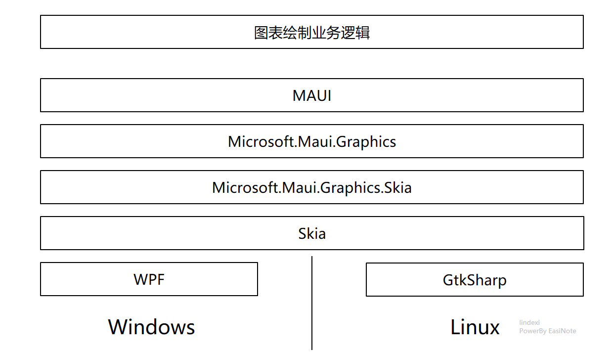
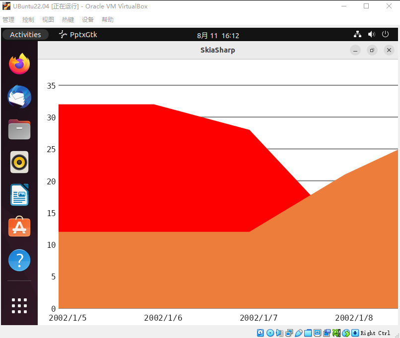
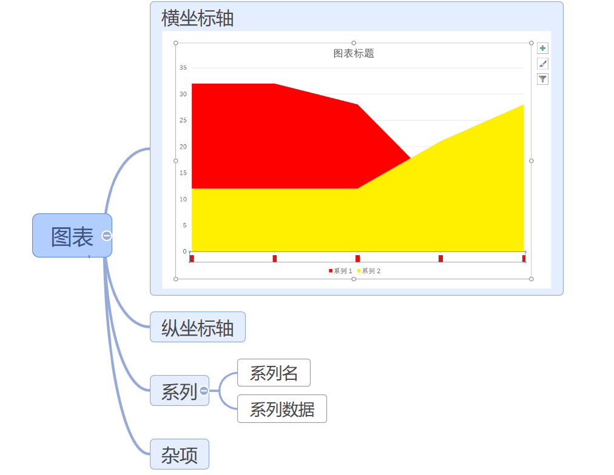
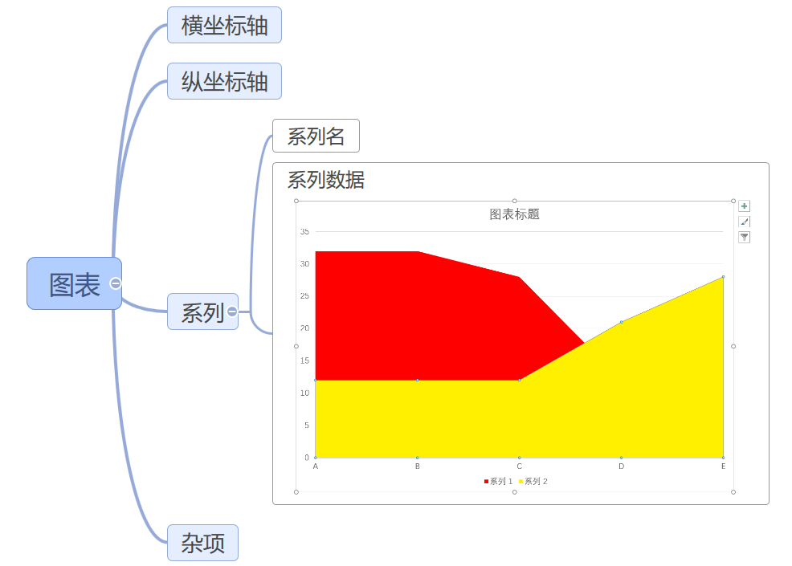

# dotnet OpenXML 使用 MAUI 渲染 PPT 的面积图图表

我在做一个图表工具软件，这个软件使用 MAUI 开发。我的需求是图表的内容需要和 PPT 的图表对接，需要用到 OpenXML 解析 PPT 内容，读取到 PPT 图表元素的内容，接着使用 MAUI 渲染层绘制图表元素。图表工具软件需要在 Windows 平台和 Linux 平台上运行。在 Windows 下，我采用 WPF 应用，用来辟谣说 MAUI 不支持 WPF 应用。 在 Linux 选用 Ubuntu 系统，采用 GTKSharp 应用加上 Skia 渲染对接 MAUI 框架

<!--more-->

<!-- 发布 -->
<!-- 博客 -->

图表工具软件的开发架构如下，可以看到只有和具体平台对接的一层不相同

<!--  -->


本文将包含两个部分，一个是解析渲染面积图图表，另一个是使用 MAUI 开发跨平台应用。解析面积图图表是用到 OpenXML 解析 PPT 的知识，本文只包含很少量的 OpenXML 的知识，我将详细的使用 OpenXML 解析 PPT 的面积图的方法放在了 [dotnet OpenXML 解析 PPT 图表 面积图入门](https://blog.lindexi.com/post/dotnet-OpenXML-%E8%A7%A3%E6%9E%90-PPT-%E5%9B%BE%E8%A1%A8-%E9%9D%A2%E7%A7%AF%E5%9B%BE%E5%85%A5%E9%97%A8.html ) 博客里。本文的用到的解析 PPT 的代码也是从此博客里面抄的，这部分代码将不会在本文上贴出。 如对 OpenXML 解析 PPT 毫无概念的伙伴，阅读本文也不会存在问题，只需要假定本文的解析 PPT 的代码是通过某个方式获取到了图表的相关信息即可，请将重点放在图表的绘制渲染，以及如何做跨平台对接上

本文使用的代码只能用来做例子，本文的解析 PPT 图表的代码只能支持本文例子里的测试文件，本文的测试文件和代码可以从本文最后获取

在开始之前，先看一下本文实现的效果

## 效果

这是在 PPT 的图表：

<!--  -->


在 Windows 下，使用 Skia 绘制为图片文件，然后使用 Image 控件显示图片，界面效果如下：

<!--  -->


以上只是将 MAUI 接入 WPF 的一个方法。不代表只能通过图片文件的方式接入，其他绘制方法请看 [WPF 使用 MAUI 的自绘制逻辑](https://blog.lindexi.com/post/WPF-%E4%BD%BF%E7%94%A8-MAUI-%E7%9A%84%E8%87%AA%E7%BB%98%E5%88%B6%E9%80%BB%E8%BE%91.html )

在 Linux 下，使用 Skia 对接 Gtk 框架，界面效果如下：

<!--  -->


动态运行效果如下

<!--  -->


接下来将告诉大家如何实现

## 解析绘制面积图图表

开始实现绘制 PPT 的图表之前，需要先解析图表的内容

图表的解析部分需要用到 OpenXML 知识，这部分解析的内容，在 [dotnet OpenXML 解析 PPT 图表 面积图入门](https://blog.lindexi.com/post/dotnet-OpenXML-%E8%A7%A3%E6%9E%90-PPT-%E5%9B%BE%E8%A1%A8-%E9%9D%A2%E7%A7%AF%E5%9B%BE%E5%85%A5%E9%97%A8.html ) 博客里面有详细说明。使用 [dotnet OpenXML 解析 PPT 图表 面积图入门](https://blog.lindexi.com/post/dotnet-OpenXML-%E8%A7%A3%E6%9E%90-PPT-%E5%9B%BE%E8%A1%A8-%E9%9D%A2%E7%A7%AF%E5%9B%BE%E5%85%A5%E9%97%A8.html ) 的方法解析出图表的内容将获取到的内容放入到 AreaChartRenderContext 类型，此类型用来提供渲染绘制使用的上下文，包括以下属性

```csharp
/// <summary>
///     用来提供图表 面积图 渲染的上下文信息
/// </summary>
public class AreaChartRenderContext
{
    // 忽略代码

    public ChartSpace ChartSpace { get; }
    public SlideContext SlideContext { get; }
    public Pixel Width { get; }
    public Pixel Height { get; }

    /// <summary>
    ///     类别轴上的数据 横坐标轴上的数据
    /// </summary>
    public ChartValueList CategoryAxisValueList { get; } = null!;

    /// <summary>
    ///     面积图的系列信息集合
    /// </summary>
    public AreaChartSeriesInfoList AreaChartSeriesInfoList { get; } = new();
}
```

上面代码的 `ChartSpace` 属性是图表元素，通过 [dotnet OpenXML 解析 PPT 图表 面积图入门](https://blog.lindexi.com/post/dotnet-OpenXML-%E8%A7%A3%E6%9E%90-PPT-%E5%9B%BE%E8%A1%A8-%E9%9D%A2%E7%A7%AF%E5%9B%BE%E5%85%A5%E9%97%A8.html ) 博客可以了解到里面包含图表的信息。上面代码的 `SlideContext` 属性是我所在的团队开源的 OpenXml 解析辅助库提供的包含元素所在页面的类型，详细请看: [https://github.com/dotnet-campus/DocumentFormat.OpenXml.Extensions](https://github.com/dotnet-campus/DocumentFormat.OpenXml.Extensions )

图表关键的信息包含类别轴上的数据，也称为横坐标轴上的数据，放在 `CategoryAxisValueList` 属性。系列信息集合，放在 `AreaChartSeriesInfoList` 属性。这两个属性是从 `ChartSpace` 读取，读取的方法请看 [dotnet OpenXML 解析 PPT 图表 面积图入门](https://blog.lindexi.com/post/dotnet-OpenXML-%E8%A7%A3%E6%9E%90-PPT-%E5%9B%BE%E8%A1%A8-%E9%9D%A2%E7%A7%AF%E5%9B%BE%E5%85%A5%E9%97%A8.html ) 博客或者阅读本文用到的代码

在获取到了图表的各个信息之后，即可进行绘制图表。开始进行绘制之前，还请先了解图表的各个组成部分

- 横坐标轴 类别坐标轴数据：

<!--  -->


- 纵坐标轴：

<!--  -->


- 数据系列：

在图表里面有数据系列的概念，每个系列的数据组成一个个的数据系列。对于大部分图表来说，数据层都是由一个个数据系列组成的

每个数据系列可以有自己的系列名称

<!--  -->


系列名称大部分时候都放在图例里面，也就是图例里面的内容就是由系列名称提供的

在图表里面，核心就是对数据的处理，系列的数据内容就是核心的

<!--  -->


如图，面积图有两个数据系列，通过上面的 Excel 内容可以了解到两个系列的数据分别如下

```
系列 1：32,32,28,12,15
系列 2：12,12,12,21,28
```

为了让绘制逻辑更方便阅读，定义 AreaChartRender 类用来绘制图表

图表绘制 AreaChartRender 需要两个参数，一个是 `AreaChartRenderContext` 用来提供信息，一个是 `Microsoft.Maui.Graphics.ICanvas` 用来提供渲染绘制方法。在各个平台上，可以使用不同的实现对接 MAUI 的渲染，也就是 `Microsoft.Maui.Graphics.ICanvas` 接口可以对应不同的实现。在解析渲染模块里不耦合具体的平台渲染实现，只使用抽象的接口，定义的类型如下

```csharp
public class AreaChartRender
{
    public AreaChartRender(AreaChartRenderContext context)
    {
        Context = context;
    }

    public AreaChartRenderContext Context { get; }

    public void Render(ICanvas canvas)
    {
        // 忽略代码
    }
```

图表绘制 AreaChartRender 基础的使用方法是在和 OpenXML 解析 PPT 的图表这一层对接，通过 AreaChartRenderContext 类型拿到图表的内容，创建出 AreaChartRender 对象，传递给具体的渲染层。在渲染层里，将区分平台进行渲染，各个平台定义 `Microsoft.Maui.Graphics.ICanvas` 的实现，传入到 AreaChartRender 的 Render 方法。在 Render 方法将绘制图表内容，即可通过抽象的 `Microsoft.Maui.Graphics.ICanvas` 接口，调用各个平台具体的绘制实现

使用以下代码即可使用 OpenXML 解析 PPT 的图表，获取图表内容，关于以下代码的细节逻辑，请看 [dotnet OpenXML 解析 PPT 图表 面积图入门](https://blog.lindexi.com/post/dotnet-OpenXML-%E8%A7%A3%E6%9E%90-PPT-%E5%9B%BE%E8%A1%A8-%E9%9D%A2%E7%A7%AF%E5%9B%BE%E5%85%A5%E9%97%A8.html )

```csharp
public class ModelReader
{
    /// <summary>
    ///     构建出面积图上下文
    /// </summary>
    /// <param name="file">这里是例子，要求只能传入 Test.pptx 文件。其他文件没有支持</param>
    /// <returns></returns>
    public AreaChartRender BuildAreaChartRender(FileInfo file)
    {
        using var presentationDocument = PresentationDocument.Open(file.FullName, false);
        var slide = presentationDocument.PresentationPart!.SlideParts.First().Slide;

        /*
          <p:cSld>
            <p:spTree>
              <p:graphicFrame>
                ...
              </p:graphicFrame>
            </p:spTree>
          </p:cSld>
        */
        // 获取图表元素，在这份课件里，有一个面积图。以下使用 First 忽略细节，获取图表
        var graphicFrame = slide.Descendants<GraphicFrame>().First();

        /*
              <p:graphicFrame>
                <a:graphic>
                  <a:graphicData uri="http://schemas.openxmlformats.org/drawingml/2006/chart">
                    <c:chart xmlns:c="http://schemas.openxmlformats.org/drawingml/2006/chart" xmlns:r="http://schemas.openxmlformats.org/officeDocument/2006/relationships" r:id="rId2" />
                  </a:graphicData>
                </a:graphic>
              </p:graphicFrame>
         */
        // 获取到对应的图表信息，图表是引用的，内容不是放在 Slide 页面里面，而是放在独立的图表 xml 文件里
        var graphic = graphicFrame.Graphic;
        var graphicData = graphic?.GraphicData;
        var chartReference = graphicData?.GetFirstChild<ChartReference>();

        // 获取到 id 也就是 `r:id="rId2"` 根据 Relationship 的描述，可以知道去 rels 文件里面获取关联的内容。在 OpenXml SDK 里，封装好了获取方法，获取时需要有两个参数，一个是 id 另一个是去哪里获取的 Part 内容
        var id = chartReference?.Id?.Value;

        // 这里需要告诉 OpenXml SDK 去哪里获取资源。详细请看 https://blog.lindexi.com/post/dotnet-OpenXML-%E4%B8%BA%E4%BB%80%E4%B9%88%E8%B5%84%E6%BA%90%E4%BD%BF%E7%94%A8-Relationship-%E5%BC%95%E7%94%A8.html 
        // 如果是放在模版里面，记得要用模版的 Part 去获取
        var currentPart = slide.SlidePart!;

        if (!currentPart.TryGetPartById(id!, out var openXmlPart))
        {
            // 在这份课件里，一定不会进入此分支
            // 一定能从页面找到对应的资源内容也就是图表
        }

        var chartPart = (ChartPart) openXmlPart!;

        // 这里的 ChartPart 对应的就是 charts\chartN.xml 文件。这里的 chartN.xml 表示的是 chart1.xml 或 chart2.xml 等文件
        var chartSpace = chartPart.ChartSpace;

        var slideContext = new SlideContext(slide, presentationDocument);

        var transformData = graphicFrame.GetOrCreateTransformData(slideContext);

        return new AreaChartRender(new AreaChartRenderContext(chartSpace, slideContext, transformData.Width.ToPixel(),
            transformData.Height.ToPixel()));
    }
}
```

具体的平台渲染实现部分，放在下一章。下面先在 Render 方法对接 MAUI 的抽象的 `Microsoft.Maui.Graphics.ICanvas` 接口，进行绘制图表。绘制图表的工作量包括绘制坐标轴信息，计算刻度线，对各个系列的绘制

本文这里采用的是绝对布局方式，相对来说用到的知识简单。缺点是很多计算都会放在下面代码，看起来比较复杂，好在计算只是小学数学的加减

下面的绘制代码只能作为本文的例子使用，很多原本需要进行排版计算的值，为了方便理解，我都使用常量，如下面代码，还请忽略这部分的细节

```csharp
    public void Render(ICanvas canvas)
    {
        // 图表标题
        float chartTitleHeight = 52;
        // 图例高度，图例是放在最下方
        float chartLegendHeight = 42;
        // 类别信息的高度
        float axisValueHeight = 20;

        float yAxisLeftMargin = 42;
        float yAxisRightMargin = 42;
        float xAxisBottomMargin = 25;
    }
```

从 OpenXML 解析的 PPT 图表获取到的 AreaChartRenderContext 拿到图表的元素尺寸，用来作为图表绘制画布的限制尺寸

```csharp
        var chartWidth = (float) Context.Width.Value;
        var chartHeight = (float) Context.Height.Value;
```

以上的数值定义全部采用 float 类型，其原因是 MAUI 为了更好的适配更多的平台，选用了 float 作为渲染绘制的参数的通用类型。这一点和 WPF 的不相同，在 WPF 或 UWP 或 WinFroms 等，通用的绘制计算都采用 double 类型。对于渲染绘制，大部分情况，使用 float 也是够用的。如果一个 double 值的范围是在 float 内，那进行 double 转 float 也是安全的。至于性能的损耗，如果不是热点代码，也可以忽略

通过以上的信息即可计算出图表的绘制范围，包括坐标和尺寸

```csharp
        var plotAreaOffsetX = yAxisLeftMargin;
        var plotAreaOffsetY = chartTitleHeight;
        var plotAreaWidth = chartWidth - yAxisLeftMargin - yAxisRightMargin;
        var plotAreaHeight = chartHeight - chartTitleHeight - chartLegendHeight - xAxisBottomMargin;
```

这些信息属于布局信息，本文这里只是使用简单的固定数值计算，而不是跟随具体的图表数据进行计算，以上的代码比较“塑料”还请不要抄到实际项目代码。完成布局计算之后，开始绘制坐标轴信息。坐标轴信息包含了刻度信息，也就是 Y 轴的刻度。刻度信息包括了每个刻度之间的数值间隔是多少，最大值和最小值是多少的信息。我采用了玄学的计算方法 GetRatio 获取到了刻度的间隔的值，以及和这份 PPT 的图表一样固定了只有 8 条线

```csharp
        var rowLineCount = 8; // 这份 PPT 测试文件里只有 8 条线
        // 获取数据最大值
        var maxData = GetMaxValue();
        // 获取刻度的值
        var ratio = GetRatio(maxData, rowLineCount); // 这是一个玄学的方法。才不告诉你方法里面直接返回了一个常量
        var maxValue = ratio * (rowLineCount - 1);
```

完成了基础计算，接下来可以开始绘制坐标轴。绘制坐标轴就需要用到 MAUI 的绘制知识，对这些绘制知识感兴趣还请参阅官方文档： [Graphics - .NET MAUI Microsoft Docs](https://docs.microsoft.com/en-us/dotnet/maui/user-interface/graphics/ )

绘制坐标轴，本质上是绘制网格线，步骤是先绘制 Y 轴，再绘制 X 轴。如 PPT 的图表效果，这份文档的 Y 轴只有刻度，也就是需要绘制 Y 轴的刻度和 x 行的线。在 MAUI 里，绘制线条只需要使用 DrawLine 方法，传入两个点即可。控制线条的粗细和颜色等，是通过在 DrawLine 方法之前，先设置好参数属性。如下面代码绘制 X 行的线

```csharp
        for (var i = 0; i < rowLineCount; i++)
        {
            canvas.StrokeSize = 2;
            canvas.StrokeColor = Colors.Gray;

            var offsetX = plotAreaOffsetX;
            var offsetY = plotAreaOffsetY + plotAreaHeight - plotAreaHeight / (rowLineCount - 1) * i;

            canvas.DrawLine(offsetX, offsetY, offsetX + plotAreaWidth, offsetY);
        }
```

以上代码通过 StrokeSize 设置绘制的线条的粗细是 2 的值，这里的值是没有一个单位的，具体的单位是具体的渲染平台自己赋予的，可以认为是像素。使用 StrokeColor 设置线条的颜色，再使用 DrawLine 传入两个点，绘制出线条

接下来继续绘制 Y 轴的刻度。绘制刻度需要用到文本绘制的方法，文本绘制中存在一个小问题，那就是中文字体设置的问题，好在此问题被我修复了，详细请看 [Fix set the Font to Microsoft.Maui.Graphics.Skia by lindexi · Pull Request #9124 · dotnet/maui](https://github.com/dotnet/maui/pull/9124 )

以下代码只是绘制数字而已，不需要设置中文字体，也就不会踩到上文说到的坑。为了让绘制文本对齐到刻度，需要给定绘制文本的范围，这里稍微有一些知识需要了解，详细请看 [Microsoft.Maui.Graphics.Skia 使用 DrawString 绘制文本的坐标问题](https://blog.lindexi.com/post/Microsoft.Maui.Graphics.Skia-%E4%BD%BF%E7%94%A8-DrawString-%E7%BB%98%E5%88%B6%E6%96%87%E6%9C%AC%E7%9A%84%E5%9D%90%E6%A0%87%E9%97%AE%E9%A2%98.html )

```csharp
            // 获取刻度的值
            var fontSize = 16f;
            canvas.FontSize = fontSize;
            var textRightMargin = 5;
            var textX = 0;
            var textY = offsetY - fontSize / 2f;
            var textWidth = plotAreaOffsetX - textX - textRightMargin;
            var textHeight = 25;
            // 获取刻度的文本
            var value = (ratio * i).ToString(CultureInfo.CurrentCulture);
            canvas.DrawString(value, textX, textY, textWidth, textHeight, HorizontalAlignment.Right, VerticalAlignment.Top);
```

和绘制线条相同的是，在绘制文本之前，通过参数属性设置文本的属性，例如上面代码设置了文本的字体大小。同样，这里的字体大小也是没有具体单位的，由具体的平台实现决定，大部分情况可以认为是像素单位

完成了绘制 Y 轴的刻度和 x 行的线，继续绘制放在 X 轴底部的类别信息，也就是对应本文的图表的日期信息。好在日期的表示的字符串也没有用到中文，依然不会踩到上文描述的中文字体的坑

```csharp
        // 绘制 X 轴，绘制类别信息
        var categoryAxisValueList = Context.CategoryAxisValueList.ValueList;
        for (var i = 0; i < categoryAxisValueList.Count; i++)
        {
            var offsetX = plotAreaOffsetX + plotAreaWidth * i / (categoryAxisValueList.Count - 1);
            var offsetY = plotAreaOffsetY + plotAreaHeight;

            var textX = offsetX - 20;
            var textY = offsetY + xAxisBottomMargin;
            if (i < categoryAxisValueList.Count)
            {
                var text = categoryAxisValueList[i].GetViewText();
                canvas.DrawString(text, textX, textY, HorizontalAlignment.Left);
            }
        }
```

绘制类别信息的工作量就是计算出文本的坐标，和使用 GetViewText 方法，获取到具体类别里的用户可见的文本的字符串，然后调用 DrawString 方法即可

完成坐标轴的绘制之后，就进入关键的 DrawArea 方法，在此方法里面，将会绘制图表的数据信息。将图表的各个系列的数据作为面积图绘制

绘制面积图图表的方法是获取到图表的各个系列的数值信息，根据这些数值创建出一段 Path Geometry 路径几何用于填充面积图。创建路径几何可使用 PathF 类型创建一个基于 float 存储信息的路径几何。这里的 PathF 就是 Path + Float 的意思，如以下代码进行创建

```csharp
  using var path = new PathF();
```

在 MAUI 里，这个 PathF 是推荐做释放的，在各个平台的 PathF 的底层实现有所不同，不代表着一定需要释放。好在多调用释放是安全的，这里就加上 using 用来在方法执行结束释放。开始绘制之前，先准备一点点路径几何创建的知识。按照 Path 的创建惯例，开始点采用 Move 方法设置，如以下代码

```csharp
  path.Move(startX, startY);
```

在 MAUI 的设计里，可以使用连续的方法，输入绘制参数，如画两条线，然后设置几何关闭，可以采用如下代码

```csharp
            path.LineTo(x1, y1)
                .LineTo(x2, y2)
                .Close();
```

如上面代码即可画出一段路径集合出来，本文会用到的也仅仅只是以上几个方法，这也就是本文用到的核心绘制路径的知识。当然，路径几何 PathF 是一个复杂的类型，拥有的方法和功能可远不止本文介绍的这一点，更多绘制知识，还请参阅官方文档。在了解了基础用法，接下来开始绘制面积图

绘制面积图只是一些计算逻辑，通过给定的数据计算出 PathF 的内容，代码如下

```csharp
        for (var chartDataIndex = 0; chartDataIndex < Context.AreaChartSeriesInfoList.Count; chartDataIndex++)
        {
            var chartSeriesInfo = Context.AreaChartSeriesInfoList[chartDataIndex];
            if (chartSeriesInfo.ChartValueList is null)
            {
                continue;
            }

            using var path = new PathF();
            var startX = plotAreaOffsetX;
            var startY = plotAreaOffsetY + plotAreaHeight;
            path.Move(startX, startY);

            for (var i = 0; i < chartSeriesInfo.ChartValueList.ValueList.Count; i++)
            {
                var value = chartSeriesInfo.ChartValueList.ValueList[i];

                if (value is NumericChartValue numericChartValue)
                {
                    var offsetX = plotAreaOffsetX + plotAreaWidth * i / (categoryAxisValueList.Count - 1);
                    var offsetY = plotAreaOffsetY + plotAreaHeight -
                                  numericChartValue.GetValue() / maxValue * plotAreaHeight;

                    path.LineTo(offsetX, (float) offsetY);
                }
            }

            path.LineTo(plotAreaOffsetX + plotAreaWidth, plotAreaOffsetY + plotAreaHeight)
                .LineTo(startX, startY)
                .Close();

        }
```

创建 path 路径完成，即可绘制到画布。按照惯例，绘制需要先设置填充颜色，再绘制

```csharp
                // 在这份课件里，一定是纯色
                var (success, a, r, g, b) =
                    BrushCreator.ConvertToColor(chartSeriesInfo.FillBrush!.GetFill<SolidFill>()!.RgbColorModelHex!.Val!);

                var color = new Color(r, g, b, a); // 获取到各个系列的填充颜色
                canvas.FillColor = color;

                canvas.FillPath(path);
```

以上简单的代码即可完成图表的绘制。我将上面代码放在一个方法，方便大家阅读

```csharp
    public void Render(ICanvas canvas)
    {
        var chartWidth = (float) Context.Width.Value;
        var chartHeight = (float) Context.Height.Value;

        // 图表标题
        float chartTitleHeight = 52;
        // 图例高度，图例是放在最下方
        float chartLegendHeight = 42;
        // 类别信息的高度
        float axisValueHeight = 20;

        float yAxisLeftMargin = 42;
        float yAxisRightMargin = 42;
        float xAxisBottomMargin = 25;

        var plotAreaOffsetX = yAxisLeftMargin;
        var plotAreaOffsetY = chartTitleHeight;
        var plotAreaWidth = chartWidth - yAxisLeftMargin - yAxisRightMargin;
        var plotAreaHeight = chartHeight - chartTitleHeight - chartLegendHeight - xAxisBottomMargin;

        // void CreateCoordinate()
        // 绘制坐标系

        // 先找到 Y 轴的刻度，找到最大值

        // 有多少条行的线，保持和 PPT 相同
        var rowLineCount = 8;
        // 获取数据最大值
        var maxData = GetMaxValue();
        // 获取刻度的值
        var ratio = GetRatio(maxData, rowLineCount);
        var maxValue = ratio * (rowLineCount - 1);

        // 绘制网格线，先绘制 Y 轴，再绘制 X 轴
        // 绘制 Y 轴的刻度和 x 行线
        for (var i = 0; i < rowLineCount; i++)
        {
            canvas.StrokeSize = 2;
            canvas.StrokeColor = Colors.Gray;

            var offsetX = plotAreaOffsetX;
            var offsetY = plotAreaOffsetY + plotAreaHeight - plotAreaHeight / (rowLineCount - 1) * i;

            canvas.DrawLine(offsetX, offsetY, offsetX + plotAreaWidth, offsetY);

            // 获取刻度的值
            var fontSize = 16f;
            canvas.FontSize = fontSize;
            var textRightMargin = 5;
            var textX = 0;
            var textY = offsetY - fontSize / 2f;
            var textWidth = plotAreaOffsetX - textX - textRightMargin;
            var textHeight = 25;
            var value = (ratio * i).ToString(CultureInfo.CurrentCulture);
            canvas.DrawString(value, textX, textY, textWidth, textHeight, HorizontalAlignment.Right,
                VerticalAlignment.Top);
        }

        // 绘制 X 轴，绘制类别信息
        var categoryAxisValueList = Context.CategoryAxisValueList.ValueList;
        for (var i = 0; i < categoryAxisValueList.Count; i++)
        {
            var offsetX = plotAreaOffsetX + plotAreaWidth * i / (categoryAxisValueList.Count - 1);
            var offsetY = plotAreaOffsetY + plotAreaHeight;

            var textX = offsetX - 20;
            var textY = offsetY + xAxisBottomMargin;
            if (i < categoryAxisValueList.Count)
            {
                var text = categoryAxisValueList[i].GetViewText();
                canvas.DrawString(text, textX, textY, HorizontalAlignment.Left);
            }
        }

        // void DrawArea()
        // 绘制内容
        for (var chartDataIndex = 0; chartDataIndex < Context.AreaChartSeriesInfoList.Count; chartDataIndex++)
        {
            var chartSeriesInfo = Context.AreaChartSeriesInfoList[chartDataIndex];
            if (chartSeriesInfo.ChartValueList is null)
            {
                continue;
            }

            using var path = new PathF();
            var startX = plotAreaOffsetX;
            var startY = plotAreaOffsetY + plotAreaHeight;
            path.Move(startX, startY);

            for (var i = 0; i < chartSeriesInfo.ChartValueList.ValueList.Count; i++)
            {
                var value = chartSeriesInfo.ChartValueList.ValueList[i];

                if (value is NumericChartValue numericChartValue)
                {
                    var offsetX = plotAreaOffsetX + plotAreaWidth * i / (categoryAxisValueList.Count - 1);
                    var offsetY = plotAreaOffsetY + plotAreaHeight -
                                  numericChartValue.GetValue() / maxValue * plotAreaHeight;

                    path.LineTo(offsetX, (float) offsetY);
                }
            }

            path.LineTo(plotAreaOffsetX + plotAreaWidth, plotAreaOffsetY + plotAreaHeight)
                .LineTo(startX, startY)
                .Close();

            if (chartDataIndex < Context.AreaChartSeriesInfoList.Count)
            {
                // 在这份课件里，一定是纯色
                var (success, a, r, g, b) =
                    BrushCreator.ConvertToColor(chartSeriesInfo.FillBrush!.GetFill<SolidFill>()!.RgbColorModelHex!
                        .Val!);

                var color = new Color(r, g, b, a);
                canvas.FillColor = color;
            }

            canvas.FillPath(path);
        }
    }
```

原本是将上面代码拆开作为多个函数，为了方便调试，还是放在一个函数里。在实际项目上，不要让一个方法的代码如此多

## 开发跨平台应用

完成图表的绘制逻辑，接下来需要各个平台进行对接。与 MAUI 的对接是十分简单的，按照惯例，是先安装 NuGet 库，然后调用库提供的方法即可完成对接。先对接 Windows 平台的 WPF 应用

在 WPF 应用里，这次采用的是对接图片文件渲染方法。如本文开始的开发架构图所述，在 Windows 上通过 `Microsoft.Maui.Graphics.Skia` 将 Skia 和 MAUI 对接，使用 Skia 作为 MAUI 的画布，在绘制完成之后使用 Skia 保存本地图片文件，再使用 WPF 渲染保存的图片

这不代表着在 WPF 里面，只能通过 Skia 才能和 MAUI 对接，也不代表着 WPF 对接 Skia 只能通过本地图片的显示。关于在 WPF 里面，直接对接 MAUI 的方法请看 [WPF 使用 MAUI 的自绘制逻辑](https://blog.lindexi.com/post/WPF-%E4%BD%BF%E7%94%A8-MAUI-%E7%9A%84%E8%87%AA%E7%BB%98%E5%88%B6%E9%80%BB%E8%BE%91.html )

关于在 WPF 里面，使用 WriteableBitmap 控件作为 Skia 的输出的方式，让 WPF 对接 Skia 的方法请看 [WPF 使用 Skia 绘制 WriteableBitmap 图片](https://blog.lindexi.com/post/WPF-%E4%BD%BF%E7%94%A8-Skia-%E7%BB%98%E5%88%B6-WriteableBitmap-%E5%9B%BE%E7%89%87.html )

回到对接的逻辑，由于本文的 WPF 应用只负责将 Skia 保存的图片进行渲染，也就是说 WPF 层是可以不知道任何 MAUI 和 Skia 的逻辑，只需要知道保存的图片文件在哪即可。既然没有什么 WPF 的逻辑，那就先来关注一下 Skia 的对接逻辑

这里的 Skia 逻辑包括两个部分，一个是 Skia 输出到本地图片文件，另一个是 Skia 对接 MAUI 的逻辑。关于 Skia 对接 MAUI 的逻辑，细节可参阅 [dotnet 控制台 使用 Microsoft.Maui.Graphics 配合 Skia 进行绘图入门](https://blog.lindexi.com/post/dotnet-%E6%8E%A7%E5%88%B6%E5%8F%B0-%E4%BD%BF%E7%94%A8-Microsoft.Maui.Graphics-%E9%85%8D%E5%90%88-Skia-%E8%BF%9B%E8%A1%8C%E7%BB%98%E5%9B%BE%E5%85%A5%E9%97%A8.html ) 文档，本文将不包含细节逻辑

开始之前，按照惯例先安装 NuGet 库。在 dotnet 6 应用里，通过编辑 csproj 项目文件的方式可以快速安装 NuGet 库，在 csproj 文件上加上以下代码用来安装 NuGet 库。安装的 NuGet 库包括用来解析 PPT 的 `dotnetCampus.DocumentFormat.OpenXml.Flatten` 和 `dotnetCampus.OpenXmlUnitConverter` 和 `DocumentFormat.OpenXml` 库，和 MAUI 的 `Microsoft.Maui.Graphics` 和 `Microsoft.Maui.Graphics.Skia` 库

```xml
    <ItemGroup>
        <PackageReference Include="dotnetCampus.DocumentFormat.OpenXml.Flatten" Version="2.1.0" />
        <PackageReference Include="dotnetCampus.OpenXmlUnitConverter" Version="2.1.0" />
        <PackageReference Include="DocumentFormat.OpenXml" Version="2.17.1" />

        <PackageReference Include="Microsoft.Maui.Graphics" Version="6.0.403" />
        <PackageReference Include="Microsoft.Maui.Graphics.Skia" Version="6.0.403" />
    </ItemGroup>
```

为了方便开发，我将 Skia 对接 MAUI 的逻辑，封装到 SkiaPngImageRenderCanvas 类型。此类型继承 IRenderCanvas 接口，接口定义如下

```csharp
/// <summary>
///     渲染画板
/// </summary>
public interface IRenderCanvas
{
    /// <summary>
    ///     开始进行渲染
    /// </summary>
    /// <param name="action"></param>
    void Render(Action<ICanvas> action);
}
```

通过调用 Render 方法，传入委托，委托的参数就是 `Microsoft.Maui.Graphics.ICanvas` 接口，在此委托里面完成实际的绘制逻辑

创建 SkiaPngImageRenderCanvas 需要三个参数，分别是宽度高度的画布尺寸，也就是保存的图片的尺寸，这里的单位是像素，和保存的文件。上层业务调用 Render 完成，将输出文件

```csharp

/// <summary>
///     提供使用 png 作为输出的 Skia 画板
/// </summary>
public class SkiaPngImageRenderCanvas : IRenderCanvas
{
    private readonly int _width;
    private readonly int _height;
    private readonly FileInfo _outputPngFile;

    public SkiaPngImageRenderCanvas(int width, int height, FileInfo outputPngFile)
    {
        _width = width;
        _height = height;
        _outputPngFile = outputPngFile;
    }

    public void Render(Action<ICanvas> action)
    {
    	// 忽略代码
    }
```

在 Render 方法里，将先创建 Skia 的画布，接着使用 Skia 的画布创建 MAUI 的画布，将 MAUI 的画布传入到委托作为参数，绘制完成保存本地文件

在 Skia 里面，最重要的概念是画布 SKCanvas 类型，基本的绘制逻辑都是调用此类型的方法完成。通过此类型即可在上面绘制内容。而 Skia 与 MAUI 的对接里，也需要用到此类型，对接的方法是创建 `Microsoft.Maui.Graphics.Skia.SkiaCanvas` 对象，此 SkiaCanvas 对象继承了 `Microsoft.Maui.Graphics.ICanvas` 接口，即可用来传入图表的绘制层作为绘制的画布

初始化 SkiaCanvas 对象就需要用到 SKCanvas 对象，以下代码包含了创建 SKCanvas 对象和使用 SKCanvas 对象创建出 SkiaCanvas 对象

```csharp
    public void Render(Action<ICanvas> action)
    {
        var skImageInfo = new SKImageInfo(_width, _height, SKColorType.Bgra8888, SKAlphaType.Unpremul, SKColorSpace.CreateSrgb());

        using (var skImage = SKImage.Create(skImageInfo))
        {
            using (var skBitmap = SKBitmap.FromImage(skImage))
            {
                using (var skCanvas = new SKCanvas(skBitmap))
                {
                    skCanvas.Clear(SKColors.Transparent);

                    var skiaCanvas = new SkiaCanvas();
                    skiaCanvas.Canvas = skCanvas;

                    ICanvas canvas = skiaCanvas;

                    action(canvas);

                    // 忽略代码
                }
            }
        }
    }
```

接着在执行 `action` 委托完成之后，保存为本地图片，代码如下

```csharp
                    skCanvas.Clear(SKColors.Transparent);

                    var skiaCanvas = new SkiaCanvas();
                    skiaCanvas.Canvas = skCanvas;

                    ICanvas canvas = skiaCanvas;

                    action(canvas);

                    skCanvas.Flush();

                    using (var skData = skBitmap.Encode(SKEncodedImageFormat.Png, 100))
                    {
                        var file = _outputPngFile;
                        using (var fileStream = file.OpenWrite())
                        {
                            fileStream.SetLength(0);
                            skData.SaveTo(fileStream);
                        }
                    }
```

以上代码忽略细节逻辑，更多对接细节请看 [dotnet 控制台 使用 Microsoft.Maui.Graphics 配合 Skia 进行绘图入门](https://blog.lindexi.com/post/dotnet-%E6%8E%A7%E5%88%B6%E5%8F%B0-%E4%BD%BF%E7%94%A8-Microsoft.Maui.Graphics-%E9%85%8D%E5%90%88-Skia-%E8%BF%9B%E8%A1%8C%E7%BB%98%E5%9B%BE%E5%85%A5%E9%97%A8.html )

以上就完成了 Skia 的对接，接下来就交给 WPF 层，将 OpenXML 解析和 Skia 和 MAUI 对接一起

先对接 OpenXML 解析 PPT 图表的逻辑。获取测试文件，将测试文件传入 ModelReader 构建出 AreaChartRender 用来绘制，如此即可完成 OpenXML 的对接

```csharp
            var file = new FileInfo("Test.pptx");

            var modelReader = new ModelReader();
            var areaChartRender = modelReader.BuildAreaChartRender(file);
```

接着定义输出的本地图片，创建 SkiaPngImageRenderCanvas 用来做画布。这里是随便找一个文件用来输出

```csharp
            var tempFile = Path.GetTempFileName();
            var outputFile = new FileInfo(tempFile);

            var skiaPngImageRenderCanvas = new SkiaPngImageRenderCanvas((int) Math.Ceiling(areaChartRender.Context.Width.Value), (int) Math.Ceiling(areaChartRender.Context.Height.Value), outputFile);
```

让 AreaChartRender 使用 Skia 提供的画布进行渲染，这就是关键的对接代码

```csharp
 skiaPngImageRenderCanvas.Render(areaChartRender.Render);
```

如此即可将让图表绘制到 SkiaPngImageRenderCanvas 提供的 SkiaCanvas 对象上，最终使用 SKCanvas 保存到本地文件

最后一步就是在 WPF 里面将保存的文件在界面显示

```csharp
            var image = new Image()
            {
                Width = areaChartRender.Context.Width.Value,
                Height = areaChartRender.Context.Height.Value,
                Margin = new Thickness(10, 10, 10, 10),
                Source = new BitmapImage(new Uri(outputFile.FullName))
            };

            Root.Children.Add(image);
```

以上的 Root 是一个放在 XAML 的 Grid 元素

```xml
  <Grid x:Name="Root"></Grid>
```

这就是在 WPF 上对接的方法，所有的代码如下

```csharp
    public partial class MainWindow : Window
    {
        public MainWindow()
        {
            InitializeComponent();

            Loaded += MainWindow_Loaded;
        }

        private void MainWindow_Loaded(object sender, RoutedEventArgs e)
        {
            var file = new FileInfo("Test.pptx");

            var modelReader = new ModelReader();
            var areaChartRender = modelReader.BuildAreaChartRender(file);

            var tempFile = Path.GetTempFileName();
            var outputFile = new FileInfo(tempFile);

            var skiaPngImageRenderCanvas = new SkiaPngImageRenderCanvas((int) Math.Ceiling(areaChartRender.Context.Width.Value), (int) Math.Ceiling(areaChartRender.Context.Height.Value), outputFile);

            skiaPngImageRenderCanvas.Render(areaChartRender.Render);

            var image = new Image()
            {
                Width = areaChartRender.Context.Width.Value,
                Height = areaChartRender.Context.Height.Value,
                Margin = new Thickness(10, 10, 10, 10),
                Source = new BitmapImage(new Uri(outputFile.FullName))
            };

            Root.Children.Add(image);
        }
    }
```

运行效果如下

<!--  -->


可以看到在 Windows 下，通过 WPF 对接 MAUI 是十分简单的

下面开始对接 Linux 平台的应用，在 Linux 平台上使用 GtkSharp 框架做应用，依然使用 Skia 做 MAUI 的渲染层

在 Linux 平台上的对接分为多个任务：

- 创建 GtkSharp 应用
- 将 Skia 与 GtkSharp 对接
- 将 Skia 与 MAUI 的对接

上文已经有了 Skia 和 MAUI 的对接逻辑的细节，接下来将跳过 Skia 与 MAUI 的对接部分的细节逻辑。本文接下来将重点放在如何创建 GtkSharp 应用以及将 Skia 与 GtkSharp 对接上

在开始 GtkSharp 应用的创建之前，需要先聊一点历史。嗯，本考古学家要聊的不是上古的历史了，只是聊聊现代的历史。关于上古的 Gtk 的故事，还请自行查询。回到历史故事上，很久之前 mono 组织就创建了 [https://github.com/mono/gtk-sharp](https://github.com/mono/gtk-sharp) 仓库，此仓库在 2020 之前还能勉力支持，但渐渐就跟不上 gtk 的发展了，只能支持到 gtk2 的版本。后来大佬们专门给 GtkSharp 创建了组织和仓库，在 mono 组织的 gtk-sharp 的基础上继续维护，现在支持到了 gtk3 的版本，请看 [https://github.com/GtkSharp/GtkSharp](https://github.com/GtkSharp/GtkSharp)

本文创建的 GtkSharp 应用，就是使用 [https://github.com/GtkSharp/GtkSharp](https://github.com/GtkSharp/GtkSharp) 提供的支持

手动创建的方法是先创建一个 dotnet 6 的控制台应用，接着编辑 csproj 文件，修改为以下代码，安装 GtkSharp 和 SkiaSharp.Views.Gtk3 库。如以下代码可以了解到创建一个 GtkSharp 项目十分简单，只需要安装上支持 .NET Standard 2.0 及以上框架的 GtkSharp 库即可

```xml
<Project Sdk="Microsoft.NET.Sdk">

  <PropertyGroup>
    <OutputType>WinExe</OutputType>
    <TargetFramework>net6.0</TargetFramework>
  </PropertyGroup>

  <ItemGroup>
    <None Remove="**\*.glade" />
    <EmbeddedResource Include="**\*.glade">
      <LogicalName>%(Filename)%(Extension)</LogicalName>
    </EmbeddedResource>
  </ItemGroup>

  <ItemGroup>
    <PackageReference Include="GtkSharp" Version="3.24.24.*" />
    <PackageReference Include="SkiaSharp.Views.Gtk3" Version="2.88.0" />

    <PackageReference Include="dotnetCampus.DocumentFormat.OpenXml.Flatten" Version="2.1.0" />
    <PackageReference Include="dotnetCampus.OpenXmlUnitConverter" Version="2.1.0" />
    <PackageReference Include="DocumentFormat.OpenXml" Version="2.17.1" />
    <PackageReference Include="Microsoft.Maui.Graphics" Version="6.0.403" />
    <PackageReference Include="Microsoft.Maui.Graphics.Skia" Version="6.0.403" />
    <PackageReference Include="SkiaSharp.NativeAssets.Linux.NoDependencies" Version="2.88.0" />
  </ItemGroup>

</Project>
```

其实 [https://github.com/GtkSharp/GtkSharp](https://github.com/GtkSharp/GtkSharp) 仓库的细节还是做的很好的，除了以上手工创建的方法外，还可以通过 `dotnet new` 命令创建项目。以下是使用 `dotnet new` 命令创建项目的方法

第一步是安装 `dotnet new` 模版，在控制台命令行输入以下代码即可进行安装

```
dotnet new --install GtkSharp.Template.CSharp
```

安装完成之后，即可使用如下命令创建项目，请将下面命令的 MyApplication 替换为你的项目名

```
dotnet new gtkapp -o MyApplication
```

创建好了 GtkSharp 项目和安装完成了必要的 NuGet 包之后，接下来是让 Skia 和 GtkSharp 进行对接。在开始对接之前，需要说明的是，我推荐是在 Ubuntu 上构建和运行此项目，而不是在 Windows 上运行。尽管 GtkSharp 声称是支持 Windows 平台的，而且 [https://github.com/GtkSharp/GtkSharp](https://github.com/GtkSharp/GtkSharp) 仓库也做了很多辅助构建工作，但是实际在 Windows 平台上的构建体验还是比较闹心的。为什么这么说？构建的第一步是需要将依赖下载了，依赖放在 [https://github.com/GtkSharp/Dependencies](https://github.com/GtkSharp/Dependencies) 仓库里，将依赖下载到 `%LocalAppData%\Gtk\3.24.24\gtk.zip` 文件。然而这是一个 50MB 左右的文件，在国内的垃圾网速下……

如果想要在 Windows 下构建，同时嫌弃拉 gtk-3.24.24.zip 的速度太慢，可以试试我上传到 CSDN 下载的资源 [https://download.csdn.net/download/lindexi_gd/86362889](https://download.csdn.net/download/lindexi_gd/86362889)

如果构建成功，但是运行提示 `System.DllNotFoundException: Gtk: libgtk-3-0.dll` 失败，请参阅 [https://github.com/GtkSharp/GtkSharp/issues/337](https://github.com/GtkSharp/GtkSharp/issues/337)

回到让 Skia 和 GtkSharp 进行对接的逻辑，编辑 MainWindow.glade 文件，替换为以下代码

```xml
<?xml version="1.0" encoding="UTF-8"?>
<!-- Generated with glade 3.22.1 -->
<interface>
    <requires lib="gtk+" version="3.18"/>
    <object class="GtkWindow" id="MainWindow">
        <property name="can_focus">False</property>
        <property name="title" translatable="yes">SkiaSharp</property>
        <property name="default_width">600</property>
        <property name="default_height">600</property>
    </object>
</interface>
```

这个文件就是 GTK 的界面描述，更多关于这个文件的知识，还请自行了解，这不是本文的重点。如果对 GtkSharp 不熟悉，不知道如何配置，推荐到本文最后获取所有的代码

编辑 MainWindow.cs 修改构造函数为以下代码，以下代码的含义是将一个 SKDrawingArea 对象作为窗口显示的内容，这里的 SKDrawingArea 对象里提供了 PaintSurface 事件，通过此事件即可获取到 Skia 的画布。在构造函数里，对接了 GtkSharp 和 Skia 的逻辑

```csharp
        public MainWindow()
            : this(new Builder("MainWindow.glade"))
        {
        }

        private MainWindow(Builder builder)
            : base(builder.GetObject("MainWindow").Handle)
        {
            builder.Autoconnect(this);
            DeleteEvent += OnWindowDeleteEvent;

            var skiaView = new SKDrawingArea();
            skiaView.PaintSurface += OnPaintSurface;
            skiaView.Show();
            Child = skiaView;
        }

        private void OnWindowDeleteEvent(object sender, DeleteEventArgs a)
        {
            Application.Quit();
        }

        private void OnPaintSurface(object sender, SKPaintSurfaceEventArgs e)
        {
            // 忽略代码
        }
```

在 `OnPaintSurface` 方法里面就是 Skia 的渲染回调，有点和 WPF 的 OnRender 方法类似，在此函数里，通过 `e.Surface.Canvas` 绘制的内容，将会输出到 GtkSharp 的窗口

根据上文的 WPF 对接 Skia 和 MAUI 的逻辑，可以了解到对接的方式是使用 Skia 的画布创建 MAUI 的 SkiaCanvas 画布，如以下代码

```csharp
// the the canvas and properties
var canvas = e.Surface.Canvas;

var skiaCanvas = new SkiaCanvas()
{
    Canvas = canvas,
};
```

尽管推荐 OnPaintSurface 方法只处理绘制逻辑，不要在这个方法里面写业务逻辑，但为了方便理解，在本文的例子就在 OnPaintSurface 方法处理了 PPT 解析和图表绘制逻辑。请不要在实际的项目上，在 PaintSurface 事件里，处理业务逻辑

解析 PPT 文件需要先获取到测试文件，再使用上文的 ModelReader 创建出 AreaChartRender 对象，这些逻辑在各个平台都是相同的

```csharp
            var file = new FileInfo(System.IO.Path.Combine(System.IO.Path.GetDirectoryName(Assembly.GetExecutingAssembly().Location)!, "Test.pptx"));

            var modelReader = new ModelReader();
            AreaChartRender areaChartRender = modelReader.BuildAreaChartRender(file);
```

再使用上文的对接 Skia 和 MAUI 的逻辑，获取到 `skiaCanvas` 对象，传入到 AreaChartRender 绘制，这就是最关键的代码

```csharp
areaChartRender.Render(skiaCanvas);
```

可以看到，关键的代码也只需要一句即可完成

这就是在 GtkSharp 上对接的方法，代码如下

```csharp
        private void OnPaintSurface(object sender, SKPaintSurfaceEventArgs e)
        {
            var file = new FileInfo(System.IO.Path.Combine(System.IO.Path.GetDirectoryName(Assembly.GetExecutingAssembly().Location)!, "Test.pptx"));

            var modelReader = new ModelReader();
            AreaChartRender areaChartRender = modelReader.BuildAreaChartRender(file);

            // the the canvas and properties
            var canvas = e.Surface.Canvas;

            // make sure the canvas is blank
            canvas.Clear(SKColors.White);

            var skiaCanvas = new SkiaCanvas()
            {
                Canvas = canvas,
            };
            areaChartRender.Render(skiaCanvas);
        }
```

运行的效果如下

<!--  -->


这就是使用 MAUI 在 Windows 和 Linux 上解析和绘制 PPT 的图表的例子，本文忽略了很多细节，更多细节请阅读本文使用的代码

## 代码

本文以上的测试文件和代码放在[github](https://github.com/lindexi/lindexi_gd/tree/c5477e93289a71c05787af4b1ab1dbb23f18b0e6/Pptx) 和 [gitee](https://gitee.com/lindexi/lindexi_gd/tree/c5477e93289a71c05787af4b1ab1dbb23f18b0e6/Pptx) 欢迎访问

可以通过如下方式获取本文的源代码，先创建一个空文件夹，接着使用命令行 cd 命令进入此空文件夹，在命令行里面输入以下代码，即可获取到本文的代码

```
git init
git remote add origin https://gitee.com/lindexi/lindexi_gd.git
git pull origin c5477e93289a71c05787af4b1ab1dbb23f18b0e6
```

以上使用的是 gitee 的源，如果 gitee 不能访问，请替换为 github 的源

```
git remote remove origin
git remote add origin https://github.com/lindexi/lindexi_gd.git
```

获取代码之后，打开 Pptx.sln 文件，里面的包含三个项目：

- PptxCore 是 PPT 解析和图表绘制的项目，此项目可以在 Windows 和 Linux 平台使用
- Pptx 是一个 WPF 项目
- PptxGtk 是一个 GtkSharp 项目

## 更多

更多关于 OpenXML 解析请看 [Office 使用 OpenXML SDK 解析文档博客目录](https://blog.lindexi.com/post/Office-%E4%BD%BF%E7%94%A8-OpenXML-SDK-%E8%A7%A3%E6%9E%90%E6%96%87%E6%A1%A3%E5%8D%9A%E5%AE%A2%E7%9B%AE%E5%BD%95.html )

更多关于 MAUI 请看 [博客导航](https://blog.lindexi.com/post/%E5%8D%9A%E5%AE%A2%E5%AF%BC%E8%88%AA.html )