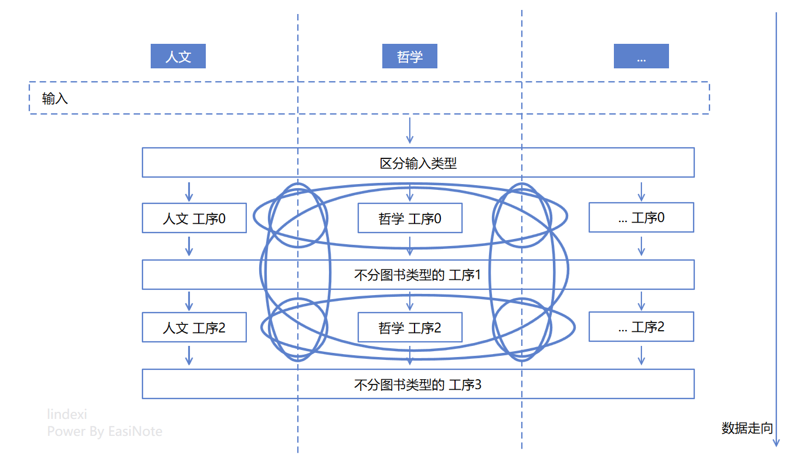

# dotnet 代码优化 聊聊逻辑圈复杂度

本文属于 dotnet 代码优化系列博客。相信大家都对圈复杂度这个概念很是熟悉，本文来和大家聊聊逻辑的圈复杂度。代码优化里面，一个关注的重点在于代码的逻辑复杂度。一段代码的逻辑复杂度越高，那么维护起来的难度也就越大。衡量代码的逻辑复杂度的一个维度是通过逻辑圈复杂度进行衡量。本文将告诉大家如何判断代码的逻辑圈复杂度以及一些降低圈复杂度的套路，让大家了解如何写出更好维护的代码

<!--more-->
<!-- CreateTime:2022/11/21 8:30:16 -->

<!-- 发布 -->

回顾一下代码设计的目标，其中一个很重要的点就是解决 复杂的代码逻辑 和 人类有限的智商 的矛盾。假设人类的智商非常的高，无论再复杂的代码逻辑都能理解，且人类写出的逻辑也不存在漏洞，那其实很多代码设计都是不需要的。现实刚好不是，一个稍微复杂的项目，就已经不是人类轻而易举能够掌控的。即使是自己编写的代码，也会随着时间逐渐遗忘代码里面当初的实现逻辑。何况在团队协作中，可能会遇到需要阅读其他开发者留下的代码的时候，假设前辈们没有好好的进行编写和设计，自然可能是给后来者挖了一个大坑

逻辑的圈复杂度属于一个度量代码复杂度的维度，但稍微特别的是，当逻辑的圈复杂度比较低时，能意味着代码复杂度比较低，比较好维护。但反过来不成立，比较好维护的代码，不一定是逻辑的圈复杂度比较低的代码。代码的可维护是需要综合考虑多个维度的，虽然说降低逻辑的圈复杂度基本上都是属于正确的事情，但由于实际项目遇到的情况比较特殊，还请识别主次矛盾，不要强行优化

逻辑的圈复杂度是指在代码执行过程中，逻辑上形成的圈的数量，更多的是指在面向对象设计里面的类和方法之间的关系。至于方法内的循环判断等，只属于（代码）圈复杂度（Cyclomatic complexity）而不是逻辑圈复杂度

学术的定义，相信大家都不感兴趣，下面来举一个例子，相信大家看完很快就懂了

例子依然是老套的图书管理系统的故事，假定书籍有 人文、哲学、物理、数学、计算机 等类型的书籍，在图书管理系统里面，需要有一定的业务逻辑，对其进行处理。其工序有些是所有类型共用的，有些是需要根据类型而来的，假定每个工序都能用一个代码方法完成。原始的逻辑设计抽象起来如下图


从逻辑上看，以上的逻辑设计是存在很多个圈圈的，相当于不停的拆分、聚合，每一次都是在增加逻辑圈复杂度，这样的逻辑设计对应到代码里面，大概就是一堆 if 或者 switch 判断，控制其后续走向，或者是面向对象的继承关系，让调用穿插在基类和子类之间。假定以上的逻辑设计属于使用了 一堆 if 或者 switch 判断的方式，那自然在区分输入类型和工序1里面，都会存在判断书籍类型，以调用后续逻辑的代码，伪代码如下

```csharp
void 区分输入类型()
{
    if (书籍类型 == 人文)
    {
        人文_工序0();
    }
    else if (书籍类型 == 哲学)
    {
        哲学_工序0();
    }
    else if(...)
    {
        ...
    }
}

void 人文_工序0()
{
    // 工序的逻辑
    ...

    不分图书类型的_工序1();
}

void 哲学_工序0()
{
    // 工序的逻辑
    ...

    不分图书类型的_工序1();
}

void 不分图书类型的_工序1()
{
    // 工序的逻辑
    ...

    if (书籍类型 == 人文)
    {
        人文_工序2();
    }
    else if (书籍类型 == 哲学)
    {
        哲学_工序2();
    }
    else if(...)
    {
        ...
    }
}

...

```

从以上的伪代码也可以看到，在 `区分输入类型` 和 `不分图书类型的_工序1` 之间，存在逻辑比较相似的代码，那就是拆分书籍类型，然后调用不同的方法。当书籍的类型足够多的时候，这个逻辑维护起来就开始令人烦躁起来了，当工序同样多起来的时候，那就更加不好玩咯

来数数逻辑的圈圈数量，猜猜有多少个圈圈？如下图标记出来的只有 4 个圈圈对不


其实没有那么简单。嗯，不严谨的算，上面的逻辑设计图至少有 9 个圈圈

<!--  -->


如果列出更多的书籍类型，以及更多的工序，那这个圈的数量能够更加庞大

大家也可以想想看，每加一个书籍类型，会加多少个圈圈？世界上还有一群专家也在研究加一个模块或一个功能时，圈复杂度的增加速率。在某些时候的设计上，会导致加一个模块或加一个功能时，增加的圈圈数量会越来越多。例如上面的逻辑设计图在两个书籍类型，也就是两个模块时，只有三个圈圈，但是在有三个模块时，就有 9 个圈圈了。也可以看到，随着书籍类型的数量，也就是模块的数量，不断增加的时候，每加一个时，增加的圈圈数量会越来越多，这也就表示了逻辑复杂度每次增加都会越来越多

换一句话说，如果按照上面的逻辑设计图的方式进行开发，会发现越开发越复杂。即使开发者有着很好的编写代码的能力，也会逐渐发现整个项目越来越难以掌控。在设计上存在将会导致必然出现的代码逻辑圈复杂度时，会导致项目在开发过程中是上帝和程序猿才能看懂代码，开发一定时间之后，就只有上帝才能看懂代码了

在了解基础的知识之后，大家也许会问，那如何改造降低圈复杂度呢？一个套路方法就是在区分类型之后，让数据的走向被具体类型进行控制，这也是面向对象里，多态的一个用法。具体来做就是在 区分输入类型 的类型之后，进入某个类型的书籍的总处理方法，在某个类型的总处理方法里面，可以愉快的从工序的开始执行到工序的结束


再来数一下逻辑的圈复杂度，是不是一个圈也数不到了？对应的代码大概如下，可以看到每个总工序里面处理的逻辑一目了然

```csharp
void 人文_总工序()
{
    人文_工序0();
    工序1();
    人文_工序2();
    工序3();
}

void 哲学_总工序()
{
    哲学_工序0();
    工序1();
    哲学_工序2();
    工序3();
}
```

啥都不用说，对比代码量就知道，看代码的清晰程度也能看起来降低圈复杂度之后的优化

那这时，也许有伙伴说，如果各个总工序都十分相似，是不是也可以再抽一下？是的，但是也需要看情况，如果少部分的重复逻辑可以带来更多的代码清晰度，那这部分的逻辑留着也是可以接受的。但如果在抽一下基础类型之后，发现逻辑依然清晰，那就开干吧，毕竟重复的逻辑也不是什么好的事情

定义一个书籍处理的抽象基类，然后在此基类里面放总工序，接着各个具体的书籍处理类型，继承基类，编写实现方法，伪代码如下

```csharp
abstract class 书籍管理基类
{
    public void 总工序()
    {
        工序0();
        工序1();
        工序2();
        工序3();
    }

    protected abstract void 工序0();

    private void 工序1()
    {
        // ...
    }
    protected abstract void 工序2();

    private void 工序3()
    {
        // ...
    }
}

class 人文书籍管理 : 书籍管理基类
{
    protected override void 工序0()
    {
        人文_工序0();
    }

    private void 人文_工序0()
    {
        // ...
    }

    protected override void 工序2()
    {
        人文_工序2();
    }

    private void 人文_工序2()
    {
        // ...
    }
}

class 哲学书籍管理 : 书籍管理基类
{
    protected override void 工序0()
    {
        哲学_工序0();
    }

    private void 哲学_工序0()
    {
        // ...
    }

    protected override void 工序2()
    {
        哲学_工序2();
    }

    private void 哲学_工序2()
    {
        // ...
    }
}
```

可以看到，这大概也就是一个超级简单的框架了，具备了一定的扩展性，也就是后续如果还需要加上新的书籍类型，也是非常方便的，只需要定义多一个类型即可，同时逻辑上也相对来说比较清真，没有那么复杂

以上是借助 C# 里面的抽象类实现的，这个套路需要不断让子类型进行重写方法，导致逻辑上可能部分是在基类，部分是在子类。不过以上的代码写法是没有问题的，因为继承关系才只有两层，但如果继承关系更多了呢？假设有三层甚至更高呢？这时执行逻辑可能需要跨越多个类型，那逻辑复杂度也会上来

假定有如下图的逻辑，需要按照顺序或者是执行时间，分别调用方法1到6来完成业务端的任务。当存在让子类型层层继承的基类有三个的时候，如果调用方法散落在这个基类里面，那逻辑复杂度将会是非常高的，很多时候静态阅读代码都非常有难度


如上图，假设以上没有画出来图，而是写成代码，那想要静态阅读代码，了解其中的执行逻辑，预计看了一会开始乱了，不知道对应的方法应该在哪个类型里面，哪个文件里面。好在 C# 里面禁用了多类型继承，否则能写出连示意图画出来都能劝退人的代码。可是 C# 里面也有一个叫虚方法的定义，允许在基类里面定义虚方法，看子类的心情去进行重写，有重写就使用子类的，没重写就采用基类的，上图里面的方法 6 是一个虚方法，在基类 2 里面定义，但是在 基类 3 被重写。这时将会发现静态阅读的代码，不见得就是实际运行的代码。例如阅读到基类 2 里面定义了方法 6 的逻辑，然而实际运行的时候，执行的是基类 3 的逻辑

这里需要补充一点的是静态阅读代码指的是和调试阅读代码相对的阅读代码方式，指的是在不开始进行调试的方式进行阅读代码，可以在 IDE 的辅助下，例如在 VisualStudio 这样的 IDE 辅助下阅读代码。好维护的代码是需要考虑静态阅读代码的，因为很多时候调试的时候能跑的路径不会特别全，也不会特别多，甚至有些逻辑是存在很多前置条件的，仅靠调试来了解执行方式，可能了解到不全面

这也是某些开发老司机会说的“组合优于继承”的其中一点原因，大量的继承将会导致逻辑散落在各地，不够“内聚”导致逻辑复杂度上升。值得一提是 “组合优于继承” 这句话是具备大量前提的，还请不要将这句话作为开发的规范

那什么时候应该选择什么方法？其实十分主观，我的推荐是多试试看，写多了，然后将自己坑多了，自然就知道了。主动去看自己之前写过的复杂逻辑（最好别去看别人的，否则心态可能会炸）看看是否会感觉自己无法理解逻辑，如果会的话，再想想可以使用什么方式，如果再写一次的话，可以更加方便阅读代码理清逻辑

回顾一下，本文告诉了大家什么是代码逻辑圈复杂度，以及降低逻辑圈复杂度的套路方法。同时也告诉了大家，这个套路也不是万能的，做的不好也可以提升代码复杂度

更多代码编写相关博客，请参阅我的 [博客导航](https://blog.lindexi.com/post/%E5%8D%9A%E5%AE%A2%E5%AF%BC%E8%88%AA.html )

特别感谢 [小方](https://github.com/RafaelLxf) 帮忙改正