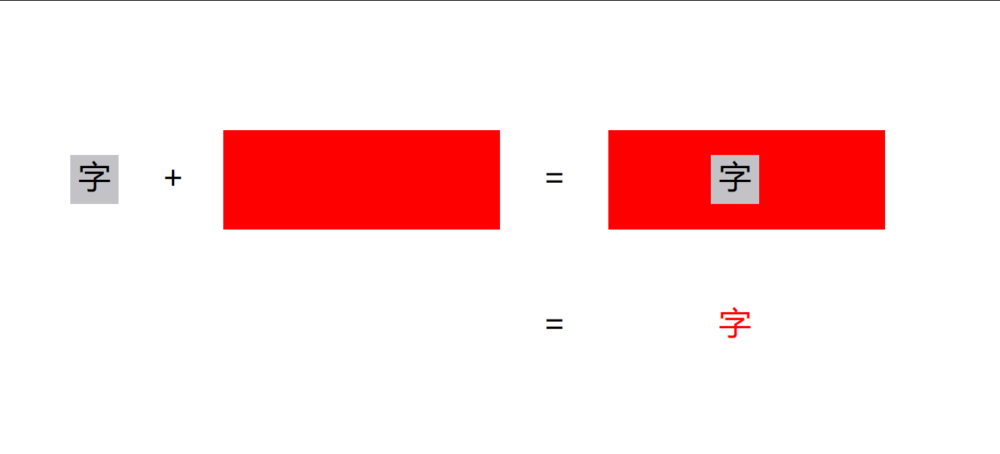
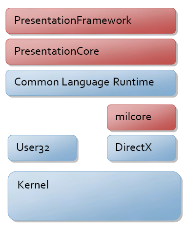

# dotnet 读 WPF 源代码笔记 渲染层是如何将字符 GlyphRun 画出来的

从业务代码构建出来 GlyphRun 对象，在 WPF 的渲染层里，如何利用 GlyphRun 提供的数据将字符在界面呈现出来。本文将和大家聊聊从 WPF 的渲染层获取到 GlyphRun 数据，到调用 DirectX 的各个渲染相关方法的过程，也就是 WPF 绘制字符的原理或者说实现方法

<!--more-->
<!-- 草稿 -->
<!-- 博客 -->

大家印象中的绘制一段文本是调用 DrawText 等相关方法，看起来很简单。本文将聊聊这个方法背后，渲染层做了哪些事情

从总的方面来讲，在 WPF 的渲染层里面，即渲染线程通过 UI 线程输入的绘制命令获取到需要执行的渲染文本字符的任务。获取到渲染文本字符的任务，在任务里面就包含了字符渲染所需的各个信息。在进入实际渲染之前，会执行一个优化判断逻辑，决定实际执行的渲染方式，是通过 Geometry 几何的方式渲染还是直接对 GlyphRun 进行渲染

优化判断逻辑的用途是为了优化性能和渲染效果，当文本的字符的渲染尺寸特别大的时候，选用 Geometry 几何的方式渲染。为什么呢？因为文本渲染里面，一个非常重要的技术就是让字符比较小的时候，可以在屏幕上清晰显示，这就是采用 GlyphRun 进行 ClearType 等方式渲染的最重要意义，然而这不是没有成本的。在文本的字符的渲染尺寸很大的时候，将会存在较多的内耗，性能上不如 Geometry 几何的方式渲染。因此在文本的字符的渲染尺寸特别大的时候，也就是不需要 ClearType 等清晰文本渲染的时候，即可使用 Geometry 几何的方式渲染提升性能

为什么使用 GlyphRun 进行渲染的方式存在比较多的内耗？为什么我用 DWrite 时不会遇到这样的问题？这其实和 WPF 底层渲染技术策略有关，我将在下文细细告诉大家。从总的方面来说是 WPF 渲染文本字符的时候，不是调用 RenderTarget 的 DrawText 或 DrawGlyphRun 等方法，而是用一个比较少见的思路进行渲染

之所以说少见是因为在 WPF 渲染层里面调用的几个 DirectX 方法，比较少有大佬写过博客讲过用法（不是没有，只是比较少）且我之前也没有用过。这是一个有趣的思路，在 WPF 渲染层里面，将调用 DirectWrite 层让 GlyphRun 输出 Alpha 纹理，接着调用 DirectX 绘制一个矩形，让矩形填充上文本前景色画刷，同时将 Alpha 纹理作为蒙层叠加到绘制的矩形上。所谓 Alpha 纹理其实就是让文本的字形转换为不透明 Alpha 通道值，用人话来说就是假如每个字都在一个矩形范围内能画出来，那笔画可见部分的像素坐标就是不透明的，否则就是透明的部分，将这些透明和不透明的放在一起就是一个 Alpha 纹理了。将这个 Alpha 纹理叠加到一个矩形上，就可以让矩形显示出来文本字符

要是觉得这个过程比较难以理解，不妨看看我画的示意图

<!--  -->


上图的灰色底黑字就是 Alpha 纹理的示意图，灰色代表着全透明，黑色代表着不透明。红色的矩形表示的是前景色是红色的字符的绘制范围。在绘制出来的红色矩形上叠加 Alpha 纹理加裁剪的效果就是只有不透明的部分可见，透明的部分就是透明的，于是结果就是最后一个等于号的红色的字的效果

为什么这么做呢？其实是因为 WPF 上的 API 定义是提供非常自由文本绘制方式，上层的 DrawingContext.DrawGlyphRun 函数允许传入任意的 Brush 类型作为文本的前景色，这就意味着允许的前景色取值范围非常广，比如 VisualBrush 等等。为了提供足够好的且强大的渲染功能，就将传入的画刷先画出来，进行矩形填充，所谓矩形填充其实和进行矩形裁剪是差不多的事情，再叠加上 Alpha 纹理。如此即可支持非常复杂的画刷，且逻辑上也是能够复用几何填充画刷逻辑

也就是说如果只是用纯色或者是图片的方式填充，自然是用不着如此复杂的方式。只有如 WPF 这样需要处理超级多诡异复杂的开发者需求的时候，才需要用如此少见的思路实现

这也就是为什么在 WPF 的渲染层不需要调用类似 RenderTarget 的 DrawText 或 DrawGlyphRun 等方法来渲染文本字符的原因

另一条渲染方式，是通过 Geometry 几何的方式渲染，这个逻辑就简单很多。通过调用 [IDWriteFontFace::GetGlyphRunOutline](https://learn.microsoft.com/en-us/windows/win32/api/dwrite/nf-dwrite-idwritefontface-getglyphrunoutline ) 方法即可从 GlyphRun 对象生成字形的 Geometry 对象，接着走 Geometry 渲染逻辑即可。本文不讨论 Geometry 渲染逻辑，继续回到 GlyphRun 渲染的细节逻辑

接下来就是代码逻辑的细节部分逻辑了，开始之前期望大家对于 WPF 框架有一定的了解。更多的 WPF 源代码博客请参阅我的 [博客导航](https://blog.lindexi.com/post/%E5%8D%9A%E5%AE%A2%E5%AF%BC%E8%88%AA.html )

在 CMilSlaveRenderData 类型的 Draw 方法里面，将会接收到 UI 线程发生给渲染线程的绘制任务，如以下代码

```c++
HRESULT
CMilSlaveRenderData::Draw(
    __in_ecount(1) IDrawingContext *pIDC
    )
{
    // 读取渲染任务
    IFC(cmdReader.GetFirstItemSafe(&nItemID, &pItemData, &nItemDataSize));
    ... // 忽略其他代码
    while (hr == S_OK)
    {
            switch (nItemID)
            {
                ... // 忽略其他代码
                case MilDrawGlyphRun:
                {
                    MILCMD_DRAW_GLYPH_RUN *pData = reinterpret_cast<MILCMD_DRAW_GLYPH_RUN*>(pItemData);
                    
                    IFC(pCurrentDC->DrawGlyphRun(
                        DYNCAST(CMilBrushDuce, rgpResources[pData->hForegroundBrush]),
                        DYNCAST(CGlyphRunResource, rgpResources[pData->hGlyphRun])
                        ));
                    break;
                }
            }

        ... // 忽略其他代码

        // 读取下一个渲染任务
        IFC(cmdReader.GetNextItemSafe(
            &nItemID,
            &pItemData,
            &nItemDataSize
            ));
    }
}
```

这里的前置知识是 WPF 至少有两个线程，一个是 UI 线程，一个是渲染线程。其中 UI 线程将会对接业务端应用的逻辑，是开发者直接编写的界面等逻辑，将会输送渲染任务给到 WPF 的渲染线程执行实际的渲染逻辑。渲染任务里面是包含了各个渲染的小点的任务项，例如界面有两个 TextBlock 那就需要至少发送两个渲染任务项，分别是两个 TextBlock 元素的渲染任务项，实际发送的数量将会更多

在 WPF 的渲染线程里面，将会进入一个类似 `while (true)` 的循环，读取完这一次，可以理解为一帧的渲染任务，的所有渲染任务项。分别对这些渲染任务项进行渲染

当然，这个过程还存在很多优化逻辑，例如缓存和不可见不渲染优化等等，这部分逻辑就散落在各个渲染具体任务的执行，也不是本文重点

其中以上代码给出的是执行任务项是 MilDrawGlyphRun 的任务。这里的 Mil 指的是 Mil 层，也就是 Media Integration Library 层，如下图在 WPF 架构里面的 milcore 层里的逻辑。架构上的功能是用来对接 DirectX 层的，细节请参阅[官方文档](https://learn.microsoft.com/en-us/dotnet/desktop/wpf/advanced/wpf-architecture) 的 WPF 架构文档

<!--  -->


以上代码的 `IFC` 是一个宏，用途就是判断方法执行是否成功。如果方法执行失败，将会调用 goto 关键字跳转到 Cleanup 标签里面。如下面代码例子，如果 GetFirstItemSafe 方法执行失败，将会 goto 到 Cleanup 的代码，进行清理和返回

```c++
HRESULT
CMilSlaveRenderData::Draw(
    __in_ecount(1) IDrawingContext *pIDC
    )
{
    // 读取渲染任务
    IFC(cmdReader.GetFirstItemSafe(&nItemID, &pItemData, &nItemDataSize));

    ... // 忽略其他代码

Cleanup:

    RRETURN(hr);
}
```

这样的写法是因为这是远古时代的逻辑，那时候要啥现代的机制都没有

以上代码的 MILCMD_DRAW_GLYPH_RUN 类型就是渲染任务项的信息，类型定义如下。大概就是一个 GlyphRun 和 ForegroundBrush 两个有用的属性

```csharp
struct MILCMD_DRAW_GLYPH_RUN
{
    MILCMD type;
    HMIL_RESOURCE hForegroundBrush;
    HMIL_RESOURCE hGlyphRun;
};
```

先不用探究 `HMIL_RESOURCE` 类型的内容，反正后面也只是调用 DYNCAST 强转而已

在拿到渲染任务项的信息，将调用 `pCurrentDC` 的 DrawGlyphRun 方法，如以下代码

```csharp
                    IFC(pCurrentDC->DrawGlyphRun(
                        DYNCAST(CMilBrushDuce, rgpResources[pData->hForegroundBrush]),
                        DYNCAST(CGlyphRunResource, rgpResources[pData->hGlyphRun])
                        ));
```

这里的 `pCurrentDC` 是 CDrawingContext 类型，继承 IDrawingContext 接口。接口的定义和上层的 DrawingContext 非常靠近

在 CDrawingContext 的 DrawGlyphRun 函数里面，将会一开始就判断是否应该使用 Geometry 几何方式渲染，代码大概如下

```c++
HRESULT
CDrawingContext::DrawGlyphRun(
    __in_ecount_opt(1) CMilBrushDuce *pBrush,
    __in_ecount_opt(1) CGlyphRunResource *pGlyphRun
    )
{
    HRESULT hr = S_OK;

    CBrushRealizer *pFillBrush = xxx; // 填充画刷，文本前景色
    ... // 忽略其他代码

    // 判断 ShouldUseGeometry 是否应该使用 Geometry 几何方式渲染，如果是，那就采用 DrawGeometry 方法进行实际的渲染
    if (pGlyphRun->ShouldUseGeometry(&m_contextState.WorldToDevice, m_contextState.GetCurrentOrDefaultDisplaySettings()))
    {
        // 获取字形的 Geometry 几何
        const CMilGeometryDuce *pGeometry = pGlyphRun->GetGeometryRes();
        ... // 忽略其他代码

        // 调用 DrawGeometry 绘制 Geometry 内容，这个 Geometry 就是文本的字形的 Geometry 几何
        DrawGeometry(
                pBrush,
                NULL, // Pen
                pGlyphRun->GetGeometryRes()
                );
    }
    else  // Assume this GlyphRun uses realizations; we will create them on demand as needed
    {
        ... // 忽略其他代码

        // 构建出 DrawGlyphsParameters 绘制 Glyphs 的参数对象
                DrawGlyphsParameters pars;
                    pars.pContextState = &m_contextState;
                    pars.pBrushContext = &m_brushContext;
                    pars.pGlyphRun = pGlyphRun;
                    pars.pBrushRealizer = pFillBrush;


                ... // 忽略其他代码

        // 调用 m_pIRenderTarget 的 DrawGlyphs 执行渲染
                IFC(m_pIRenderTarget->DrawGlyphs(pars));
    }

Cleanup:
    if (pFillBrush)
    {
        pFillBrush->FreeRealizationResources();
        pFillBrush->Release();
    }

    ... // 忽略其他代码

    RRETURN(hr);
}
```

通过上面代码可以看到，开始调用 ShouldUseGeometry 方法决定是否使用 Geometry 几何方式渲染。这里的 ShouldUseGeometry 方法里面核心就是判断文本的渲染尺寸是否很大，详细逻辑就不在这里聊，还请自行阅读源代码

调用到这里的堆栈如下

```
   wpfgfx_cor3.dll!CDrawingContext::DrawGlyphRun(CMilBrushDuce * pBrush, CGlyphRunResource * pGlyphRun) 行 1984 C++
   wpfgfx_cor3.dll!CMilSlaveRenderData::Draw(IDrawingContext * pIDC) 行 845 C++
   wpfgfx_cor3.dll!CMilVisual::RenderContent(CDrawingContext * pDrawingContext) 行 1204 C++
   wpfgfx_cor3.dll!CDrawingContext::PreSubgraph(int * pfVisitChildren) 行 5076 C++
   wpfgfx_cor3.dll!CGraphIterator::Walk(IGraphNode * pRoot, IGraphIteratorSink * pSink) 行 308   C++
   wpfgfx_cor3.dll!CDrawingContext::DrawVisualTree(CMilVisual * pRoot, const _D3DCOLORVALUE * pClearColor, const TMilRect_<float,MilRectF,MilPointAndSizeF,RectUniqueness::NotNeeded> & dirtyRect, bool fDrawingIntoVisualBrush) 行 4424   C++
   wpfgfx_cor3.dll!CDrawingContext::Render(CMilVisual * pRoot, IMILRenderTarget * pIRenderTarget, const _D3DCOLORVALUE * pClearColor, const TMilRect_<float,MilRectF,MilPointAndSizeF,RectUniqueness::NotNeeded> & rcSurfaceBounds, int fFullRender, unsigned int uNumInvalidTargetRegions, const MilRectF * rgInvalidTargetRegions, bool fCanAccelerateScroll, int * pfNeedsFullPresent) 行 5994   C++
   wpfgfx_cor3.dll!CSlaveHWndRenderTarget::Render(bool * pfNeedsPresent) 行 185   C++
   wpfgfx_cor3.dll!CRenderTargetManager::Render(bool * pfPresentNeeded) 行 339 C++
   wpfgfx_cor3.dll!CComposition::Render(bool * pfPresentNeeded) 行 859   C++
   wpfgfx_cor3.dll!CComposition::ProcessComposition(bool * pfPresentNeeded) 行 712   C++
   wpfgfx_cor3.dll!CComposition::Compose(bool * pfPresentNeeded) 行 805  C++
   wpfgfx_cor3.dll!CPartitionThread::RenderPartition(Partition * pPartition) 行 134  C++
   wpfgfx_cor3.dll!CPartitionThread::Run() 行 246   C++
   wpfgfx_cor3.dll!CPartitionThread::ThreadMain(void * pv) 行 51   C++
```

以上代码的 `m_pIRenderTarget->DrawGlyphs(pars)` 就是本文的重点，调用 `m_pIRenderTarget` 的 DrawGlyphs 方法绘制 Glyph 内容。在 WPF 的 gfx 层的规范是采用 `m_` 开头的就是表示类型的字段。这里的 `m_pIRenderTarget` 当前的运行实际类型是 CDesktopHWNDRenderTarget 类型，代码定义的是 IRenderTargetInternal 接口

这里的 CDesktopHWNDRenderTarget 表示的是对桌面窗口的 RenderTarget 封装，没有多少实际的代码，继承关系大概如下

```c++
class CDesktopHWNDRenderTarget:
    public CDesktopRenderTarget
{
}

class CDesktopRenderTarget:
    public CMILCOMBase,
    public CMetaRenderTarget,
    public IMILRenderTargetHWND
{
}

class CMetaRenderTarget:
    public IRenderTargetInternal
{
STDMETHODIMP CMetaRenderTarget::DrawGlyphs(
    __inout_ecount(1) DrawGlyphsParameters &pars
    )
    {
        ... // 忽略其他代码 
    }
}
```

继续往下的继承关系也不是本文的重点，可以看到的是 CDesktopHWNDRenderTarget 类型的 DrawGlyphs 实际是在 CMetaRenderTarget 类型里面定义的。通过这个关系代码，期望大家在阅读的时候，不会找不到代码

这里的 `CMetaRenderTarget` 的 DrawGlyphs 方法也只是一个中转，不是实际执行的逻辑，代码大概如下

```c++
STDMETHODIMP CMetaRenderTarget::DrawGlyphs(
    __inout_ecount(1) DrawGlyphsParameters &pars
    )
{
    HRESULT hr = S_OK;
    ... // 忽略其他代码
            IRenderTargetInternal *pRTInternalNoAddRef = xxx;

            IFC(pRTInternalNoAddRef->DrawGlyphs(pars));

Cleanup:
    ... // 忽略其他代码

    RRETURN(hr);
}
```

以上代码的 `pRTInternalNoAddRef` 当前的实际运行类型是 CHwHWNDRenderTarget 类型，这里的中转是为了兼容软渲染和硬渲染逻辑。这里的 CHwHWNDRenderTarget 的 Hw 的意思就是 Hardware 硬件的意思，继承关系如下

```c++
class CHwHWNDRenderTarget : 
    public CHwDisplayRenderTarget
{
}

class CHwDisplayRenderTarget :
    public CMILCOMBase,
    public CHwSurfaceRenderTarget,
    public IRenderTargetHWNDInternal
{
    STDMETHODIMP
    CHwDisplayRenderTarget::DrawGlyphs(
        __inout_ecount(1) DrawGlyphsParameters &pars
    )
    {
        ... // 忽略其他代码 
    }
}
```


进入 `CMilSlaveRenderData::Draw` 时，调用的 `m_pIRenderTarget->DrawGlyphs(pars)` 的 `m_pIRenderTarget` 对象是 CDesktopHWNDRenderTarget 类型的

```
+     m_pIRenderTarget  0x00000301aff86f20 {m_eWindowLayerType=NotLayered (0) m_rgInvalidRegions=0x00000301aff87090 {...} m_ePresentTransparency=...} IRenderTargetInternal * {CDesktopHWNDRenderTarget}
```

具体实现是在 `CMetaRenderTarget::DrawGlyphs` 里编写的

进入 `+    pRTInternalNoAddRef  0x00000301b034d780 {m_eWindowLayerType=NotLayered (0) }  IRenderTargetInternal * {CHwHWNDRenderTarget}` 的实际渲染逻辑

```csharp
>  wpfgfx_cor3.dll!CHwDisplayRenderTarget::DrawGlyphs(DrawGlyphsParameters & pars) 行 1225 C++
```

这里面是一层封装

```csharp
>  wpfgfx_cor3.dll!CHwSurfaceRenderTarget::DrawGlyphs(DrawGlyphsParameters & pars) 行 1944 C++
   wpfgfx_cor3.dll!CHwDisplayRenderTarget::DrawGlyphs(DrawGlyphsParameters & pars) 行 1232 C++
   wpfgfx_cor3.dll!CMetaRenderTarget::DrawGlyphs(DrawGlyphsParameters & pars) 行 1012   C++
   wpfgfx_cor3.dll!CDrawingContext::DrawGlyphRun(CMilBrushDuce * pBrush, CGlyphRunResource * pGlyphRun) 行 1984 C++
   wpfgfx_cor3.dll!CMilSlaveRenderData::Draw(IDrawingContext * pIDC) 行 845 C++
```

进入 CD3DGlyphRunPainter 类型

```csharp
>  wpfgfx_cor3.dll!CD3DGlyphRunPainter::Paint(DrawGlyphsParameters & pars, bool fTargetSupportsClearType, CD3DDeviceLevel1 * pDevice, MilPixelFormat::Enum fmtTargetSurface) 行 50   C++
   wpfgfx_cor3.dll!CHwSurfaceRenderTarget::DrawGlyphs(DrawGlyphsParameters & pars) 行 2067 C++
   wpfgfx_cor3.dll!CHwDisplayRenderTarget::DrawGlyphs(DrawGlyphsParameters & pars) 行 1232 C++
   wpfgfx_cor3.dll!CMetaRenderTarget::DrawGlyphs(DrawGlyphsParameters & pars) 行 1012   C++
   wpfgfx_cor3.dll!CDrawingContext::DrawGlyphRun(CMilBrushDuce * pBrush, CGlyphRunResource * pGlyphRun) 行 1984 C++
   wpfgfx_cor3.dll!CMilSlaveRenderData::Draw(IDrawingContext * pIDC) 行 845 C++
```


dotnet campus 2023 oy2lrgo2kjpd6i7xsjha5seksfs274zuxdf7hwnpei2454

```csharp
>  wpfgfx_cor3.dll!CGlyphRunRealization::RealizeAlphaBoundsAndTextures(DWRITE_TEXTURE_TYPE textureType, const EnhancedContrastTable * pECT, unsigned int * pTextureSize, tagRECT * pBoundingBox, unsigned char * * pAlphaMap) 行 1896   C++
   wpfgfx_cor3.dll!CGlyphRunRealization::EnsureValidAlphaMap(const EnhancedContrastTable * pECT) 行 1684  C++
   wpfgfx_cor3.dll!CGlyphRunResource::GetAvailableScale(float * pScaleX, float * pScaleY, const DisplaySettings * pDisplaySettings, MilTextRenderingMode::Enum textRenderingMode, MilTextHintingMode::Enum textHintingMode, RenderingMode * pRecommendedRenderingMode, CGlyphRunRealization * * ppRealization, const IDpiProvider * pDpiProvider) 行 684  C++
   wpfgfx_cor3.dll!CBaseGlyphRunPainter::Init(CGlyphPainterMemory * pGlyphPainterMemory, CGlyphRunResource * pGlyphRunResource, CContextState * pContextState) 行 109 C++
   wpfgfx_cor3.dll!CD3DGlyphRunPainter::Paint(DrawGlyphsParameters & pars, bool fTargetSupportsClearType, CD3DDeviceLevel1 * pDevice, MilPixelFormat::Enum fmtTargetSurface) 行 86   C++
   wpfgfx_cor3.dll!CHwSurfaceRenderTarget::DrawGlyphs(DrawGlyphsParameters & pars) 行 2067 C++
   wpfgfx_cor3.dll!CHwDisplayRenderTarget::DrawGlyphs(DrawGlyphsParameters & pars) 行 1232 C++
   wpfgfx_cor3.dll!CMetaRenderTarget::DrawGlyphs(DrawGlyphsParameters & pars) 行 1012   C++
   wpfgfx_cor3.dll!CDrawingContext::DrawGlyphRun(CMilBrushDuce * pBrush, CGlyphRunResource * pGlyphRun) 行 1984 C++
   wpfgfx_cor3.dll!CMilSlaveRenderData::Draw(IDrawingContext * pIDC) 行 845 C++
```

核心调用 [IDWriteGlyphRunAnalysis：：CreateAlphaTexture (dwrite.h) - Win32 apps | Microsoft Learn](https://learn.microsoft.com/zh-cn/windows/win32/api/dwrite/nf-dwrite-idwriteglyphrunanalysis-createalphatexture?f1url=%3FappId%3DDev16IDEF1%26l%3DZH-CN%26k%3Dk(DWRITE%252FIDWriteGlyphRunAnalysis%253A%253ACreateAlphaTexture)%3Bk(IDWriteGlyphRunAnalysis%253A%253ACreateAlphaTexture)%3Bk(CreateAlphaTexture)%3Bk(SolutionItemsProject)%3Bk(SolutionItemsProject)%3Bk(SolutionItemsProject)%3Bk(DevLang-C%252B%252B)%3Bk(TargetOS-Windows)%26rd%3Dtrue ) 方法获取 alpha 纹理内容

在 `CD3DSubGlyph::ValidateAlphaMap` 将 alpha 纹理内容放入到 CD3DGlyphBank 的 pTankSurface 里面

```csharp
>  wpfgfx_cor3.dll!CD3DSubGlyph::ValidateAlphaMap(CD3DGlyphRunPainter * pPainter) 行 57 C++
   wpfgfx_cor3.dll!CD3DGlyphRunPainter::Paint(DrawGlyphsParameters & pars, bool fTargetSupportsClearType, CD3DDeviceLevel1 * pDevice, MilPixelFormat::Enum fmtTargetSurface) 行 178  C++
   wpfgfx_cor3.dll!CHwSurfaceRenderTarget::DrawGlyphs(DrawGlyphsParameters & pars) 行 2067 C++
   wpfgfx_cor3.dll!CHwDisplayRenderTarget::DrawGlyphs(DrawGlyphsParameters & pars) 行 1232 C++
   wpfgfx_cor3.dll!CMetaRenderTarget::DrawGlyphs(DrawGlyphsParameters & pars) 行 1012   C++
   wpfgfx_cor3.dll!CDrawingContext::DrawGlyphRun(CMilBrushDuce * pBrush, CGlyphRunResource * pGlyphRun) 行 1984 C++
   wpfgfx_cor3.dll!CMilSlaveRenderData::Draw(IDrawingContext * pIDC) 行 845 C++

```

在 `CD3DGlyphBank::RectFillAlpha` 调用 UpdateSurface 方法


```csharp
    IFC( m_pDevice->UpdateSurface(
        pTempSurface,
        &rcTemp,
        pTankSurface,
        &dstPoint
        ));
```

更新平面和纹理

在 `CD3DGlyphRunPainter::Paint` 将放入到 `m_data.pMaskTexture = m_pSubGlyph->GetTank()->GetTextureNoAddref();` 里面

```csharp
>  wpfgfx_cor3.dll!CD3DGlyphRunPainter::Paint(DrawGlyphsParameters & pars, bool fTargetSupportsClearType, CD3DDeviceLevel1 * pDevice, MilPixelFormat::Enum fmtTargetSurface) 行 199  C++
   wpfgfx_cor3.dll!CHwSurfaceRenderTarget::DrawGlyphs(DrawGlyphsParameters & pars) 行 2067 C++
   wpfgfx_cor3.dll!CHwDisplayRenderTarget::DrawGlyphs(DrawGlyphsParameters & pars) 行 1232 C++
   wpfgfx_cor3.dll!CMetaRenderTarget::DrawGlyphs(DrawGlyphsParameters & pars) 行 1012   C++
   wpfgfx_cor3.dll!CDrawingContext::DrawGlyphRun(CMilBrushDuce * pBrush, CGlyphRunResource * pGlyphRun) 行 1984 C++
   wpfgfx_cor3.dll!CMilSlaveRenderData::Draw(IDrawingContext * pIDC) 行 845 C++
```

调用方法指针 `(this->*m_pfnDrawRectangle)()` 进行绘制矩形，在绘制矩形添加 MaskTexture 的方式，将文字当成蒙层加上，于是就能支持任意的画刷

```csharp
>  wpfgfx_cor3.dll!CD3DGlyphRunPainter::TDrawRectangle<CVertM1_CT,CRenderFan1Pass>() 行 512   C++
   wpfgfx_cor3.dll!CD3DGlyphRunPainter::Paint(DrawGlyphsParameters & pars, bool fTargetSupportsClearType, CD3DDeviceLevel1 * pDevice, MilPixelFormat::Enum fmtTargetSurface) 行 210  C++
   wpfgfx_cor3.dll!CHwSurfaceRenderTarget::DrawGlyphs(DrawGlyphsParameters & pars) 行 2067 C++
   wpfgfx_cor3.dll!CHwDisplayRenderTarget::DrawGlyphs(DrawGlyphsParameters & pars) 行 1232 C++
   wpfgfx_cor3.dll!CMetaRenderTarget::DrawGlyphs(DrawGlyphsParameters & pars) 行 1012   C++
   wpfgfx_cor3.dll!CDrawingContext::DrawGlyphRun(CMilBrushDuce * pBrush, CGlyphRunResource * pGlyphRun) 行 1984 C++
   wpfgfx_cor3.dll!CMilSlaveRenderData::Draw(IDrawingContext * pIDC) 行 845 C++
```

调用 SetTextures 方法配置

```csharp
class CVertM1_CT : public CVertM1
{
public:
    static MIL_FORCEINLINE HRESULT
    SetTextures(CD3DDeviceLevel1* pDevice, const VertexFillData* pData)
    {
        HRESULT hr = S_OK;
        IFC( pDevice->SetClearTypeOffsets(pData->ds, pData->dt) );
        IFC( pDevice->SetD3DTexture(0, pData->pMaskTexture) );
        IFC( pDevice->DisableTextureTransform(0) );
    Cleanup:
        return hr;
    }
};
```

另一个调用分支是

```csharp
   wpfgfx_cor3.dll!CGlyphRunRealization::RealizeAlphaBoundsAndTextures(DWRITE_TEXTURE_TYPE textureType, const EnhancedContrastTable * pECT, unsigned int * pTextureSize, tagRECT * pBoundingBox, unsigned char * * pAlphaMap) 行 1847   C++
   wpfgfx_cor3.dll!CGlyphRunRealization::EnsureValidAlphaMap(const EnhancedContrastTable * pECT) 行 1684  C++
>  wpfgfx_cor3.dll!CGlyphRunResource::GetAvailableScale(float * pScaleX, float * pScaleY, const DisplaySettings * pDisplaySettings, MilTextRenderingMode::Enum textRenderingMode, MilTextHintingMode::Enum textHintingMode, RenderingMode * pRecommendedRenderingMode, CGlyphRunRealization * * ppRealization, const IDpiProvider * pDpiProvider) 行 684  C++
   wpfgfx_cor3.dll!CBaseGlyphRunPainter::Init(CGlyphPainterMemory * pGlyphPainterMemory, CGlyphRunResource * pGlyphRunResource, CContextState * pContextState) 行 109 C++
   wpfgfx_cor3.dll!CD3DGlyphRunPainter::Paint(DrawGlyphsParameters & pars, bool fTargetSupportsClearType, CD3DDeviceLevel1 * pDevice, MilPixelFormat::Enum fmtTargetSurface) 行 86   C++
   wpfgfx_cor3.dll!CHwSurfaceRenderTarget::DrawGlyphs(DrawGlyphsParameters & pars) 行 2067 C++
   wpfgfx_cor3.dll!CHwDisplayRenderTarget::DrawGlyphs(DrawGlyphsParameters & pars) 行 1232 C++
   wpfgfx_cor3.dll!CMetaRenderTarget::DrawGlyphs(DrawGlyphsParameters & pars) 行 1012   C++
   wpfgfx_cor3.dll!CDrawingContext::DrawGlyphRun(CMilBrushDuce * pBrush, CGlyphRunResource * pGlyphRun) 行 1984 C++
   wpfgfx_cor3.dll!CMilSlaveRenderData::Draw(IDrawingContext * pIDC) 行 845 C++
```


RenderOptions.ProcessRenderMode = RenderMode.SoftwareOnly;

+       pRTInternalNoAddRef 0x000002d9a322ea50 {m_hwnd=0x0000000004422b20 {unused=??? } m_pPresenter=0x000002d9a14a2540 {m_pIdealDisplay=...} ...}  IRenderTargetInternal * {CSwRenderTargetHWND}

```csharp
STDMETHODIMP CMetaRenderTarget::DrawGlyphs(
    __inout_ecount(1) DrawGlyphsParameters &pars
    )
{
    HRESULT hr = S_OK;

    TraceTag((tagMILRenderDrawCalls, "%d. Draw Glyphs\n", ++g_dwCallNo));

    CRectF<CoordinateSpace::PageInPixels> const rcBoundsOrig(pars.rcBounds.PageInPixels());
    CMilRectF const *prcBounds = &rcBoundsOrig;

    UINT idxFirstEnabledRT;
    if (FindFirstEnabledRT(&idxFirstEnabledRT))
    {
        CMetaIterator metaIterator(
            m_rgMetaData,
            m_cRT,
            idxFirstEnabledRT,
            m_fUseRTOffset,
            m_pDisplaySet,      // pDisplaySet           
            NULL,               // pAliasedClip,
            &prcBounds,         // ppBoundsToAdjust,
            NULL,               // pTransform,
            pars.pContextState, // pContextState,
            NULL                // ppIBitmapSource
            );

        IFC(metaIterator.PrepareForIteration());

        do
        {
            IRenderTargetInternal *pRTInternalNoAddRef = NULL;
            IFC(metaIterator.SetupForNextInternalRT(&pRTInternalNoAddRef));

            pars.rcBounds.Device() =
                *CRectF<CoordinateSpace::Device>::ReinterpretNonSpaceTyped(prcBounds);

            IFC(pRTInternalNoAddRef->DrawGlyphs(pars)); // pRTInternalNoAddRef 0x000002d9a322ea50 {m_hwnd=0x0000000004422b20 {unused=??? } m_pPresenter=0x000002d9a14a2540 {m_pIdealDisplay=...} ...}  IRenderTargetInternal * {CSwRenderTargetHWND}

        } while (metaIterator.MoreIterationsNeeded());
    }

Cleanup:
    pars.pBrushRealizer->RestoreMetaIntermediates();

    pars.rcBounds.PageInPixels() = rcBoundsOrig;
    RRETURN(hr);
}
```

调用堆栈

```csharp
    wpfgfx_cor3.dll!CSWGlyphRunPainter::Init(DrawGlyphsParameters & pars, float flEffectAlpha, CGlyphPainterMemory * pGlyphPainterMemory, int fTargetSupportsClearType, int * pfVisible) 行 59   C++
    wpfgfx_cor3.dll!CSoftwareRasterizer::DrawGlyphRun(CSpanSink * pSpanSink, CSpanClipper * pSpanClipper, DrawGlyphsParameters & pars, CMILBrush * pBrush, float flEffectAlpha, CGlyphPainterMemory * pGlyphPainterMemory, bool fTargetSupportsClearType, bool * pfClearTypeUsedToRender) 行 424 C++
    wpfgfx_cor3.dll!CSwRenderTargetSurface::DrawGlyphs(DrawGlyphsParameters & pars) 行 1096  C++
    wpfgfx_cor3.dll!CMetaRenderTarget::DrawGlyphs(DrawGlyphsParameters & pars) 行 1012   C++
    wpfgfx_cor3.dll!CDrawingContext::DrawGlyphRun(CMilBrushDuce * pBrush, CGlyphRunResource * pGlyphRun) 行 1984 C++
    wpfgfx_cor3.dll!CMilSlaveRenderData::Draw(IDrawingContext * pIDC) 行 845 C++
```

+       m_sr    {m_rgPoints={...} m_rgTypes={...} m_Creator_sRGB={m_pConstantColorSpan=0x000002d9a32b7520 {m_Color=4292730333 } ...} ...}   CSoftwareRasterizer

>   wpfgfx_cor3.dll!CSoftwareRasterizer::DrawGlyphRun(CSpanSink * pSpanSink, CSpanClipper * pSpanClipper, DrawGlyphsParameters & pars, CMILBrush * pBrush, float flEffectAlpha, CGlyphPainterMemory * pGlyphPainterMemory, bool fTargetSupportsClearType, bool * pfClearTypeUsedToRender) 行 424 C++

